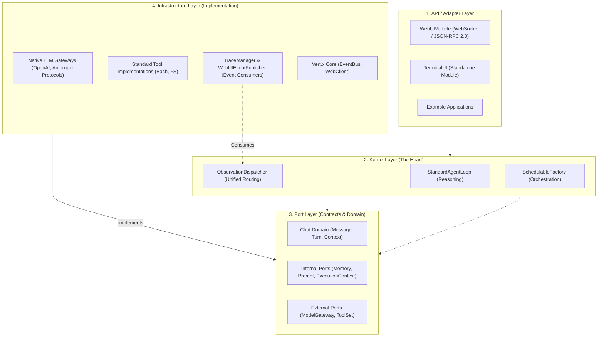

# Ganglia Architecture Documentation

> **Status:** Implemented
> **Version:** 1.4.0

## 1. System Overview

**Ganglia** is a Java-based Agent framework designed for integration into third-party applications. It prioritizes **simplicity, robustness, and transparency** over complex, opaque multi-agent graphs.

The core design philosophy follows a **Hexagonal (Ports & Adapters)** architecture, ensuring that the central reasoning loop is decoupled from specific model providers and technical implementations.

## 2. Core Design Principles

1.  **Single Control Loop (The "ReAct" Loop):**
    - Avoid complex graphs or state machines for the core reasoning.
    - Use a flat message history processed by a single main loop.
    - Flow: `Input -> [Thought -> Tool -> Observation] * N -> Answer`.

2.  **Hexagonal Decoupling:**
    - The **Kernel** (Reasoning) is isolated from **Infrastructure** (LLM, Storage).
    - All dependencies flow inward towards the Kernel and the Domain Port layer.

3.  **Unified Observation Stream:**
    - All system activities (macro loop events and micro streaming tokens/TTY) are unified into a single EventBus-driven pipeline.
    - Decouples event generation (Tools/Gateways) from transport/UI logic.

4.  **Tool-First Navigation:**
    - The agent explores codebases using tools (`grep`, `glob`, `read`) rather than relying purely on pre-computed embeddings.

5.  **Memory as Code:**
    - Memory is stored in **Markdown files** (`MEMORY.md`, Daily Records).
    - It is transparent, editable, and version-controlled.

## 3. Logical Architecture (Hexagonal)

### 3.0 Architectural Layers

The system is organized into four primary hexagonal layers.

### 3.1 The Kernel Layer ("The Brain")

- **Reasoning Loop:** `StandardAgentLoop` manages the iterative cycle of Thought, Action, and Observation.
- **Observation Dispatcher:** `DefaultObservationDispatcher` acts as the central hub for all events. It broadcasts macro events (from the loop) and micro events (from tools via `ExecutionContext`) to a unified EventBus topic (`ganglia.observations.*`).
- **Robustness:** Includes failure policies, jittered exponential backoff retries, and configurable timeouts.

### 3.2 The Port Layer ("The Contracts")

- **Internal Ports:** Define how the Kernel interacts with its internal systems. Crucially includes `ExecutionContext` which allows tools to emit stream chunks without knowing about Vert.x.
- **External Ports:** Define interactions with LLMs (`ModelGateway`) and Environment (`ToolSet`).
- **Domain Models:** Records like `Message`, `SessionContext`, and `ObservationEvent` ensure data integrity.

### 3.3 The Infrastructure Layer ("The Hands")

- **Native LLM Gateways:** Implements protocols via Vert.x `WebClient`. Supports explicit timeouts and broadened retry logic for connection resets.
- **Event Consumers:** `WebUIEventPublisher` and `TraceManager` are decoupled from the loop; they simply consume the unified observation stream and forward it to WebSockets or Files.
- **Persistence:** File-based session state and daily journaling.

## 4. The Memory System

- **Three-Tier Architecture:**
    - **Short-Term (Turn):** Raw interaction details.
    - **Medium-Term (Session):** Managed via rolling compression.
    - **Daily Journal:** Cross-session summaries in `.ganglia/memory/daily-*.md`.
    - **Long-Term (Project):** `MEMORY.md`.

## 5. Human-in-the-Loop & Steering

Ganglia supports an asynchronous **"Steering & Abort"** mechanism:

1.  **Soft Steering:** Users can inject new instructions into a session queue at any time. The Kernel checks this between reasoning steps.
2.  **Hard Abort:** An `AgentSignal` provides **active cancellation**. It allows for immediate termination of network calls (HTTP stream reset), tool executions, and token publishing, ensuring the UI stops instantly.
3.  **Interrupts:** Sensitive tools (like `ask_selection`) can pause the loop to await explicit user input via modal forms.

## 6. WebUI Observation & Control (The 3x3 Matrix)

Starting from v1.3.0, the WebUI implements a **System Interaction Matrix** to manage cognitive load:
- **Glance (Low Load)**: Real-time Phase indicators (Planning, Executing, Waiting), Mini-mode ToolCards, and **Reactive File Tree synchronization** with visual transient notifications.
- **Inspect (Medium Load)**: A side-drawer `Inspector` with TTY virtualization (TanStack Virtual), regex-based log filtering, and high-fidelity Code/Diff viewers (Shiki).
- **Block (High Load)**: Modal `AskUserForm` with embedded Diff context for high-stakes authorization and decision making.

## 7. Technology Stack

- **Language:** Java 17+
- **Core Framework:** Vert.x 5 (Reactive, Non-blocking I/O)
- **Transport:** Native WebSockets (RFC 6455)
- **Protocol:** JSON-RPC 2.0
- **UI:** Vue 3, Vite, Tailwind CSS, Pinia
- **Monitoring:** JDK WatchService (Recursive native hooks)
- **Testing:** JUnit 5, Mockito, JaCoCo, Vitest (WebUI)
