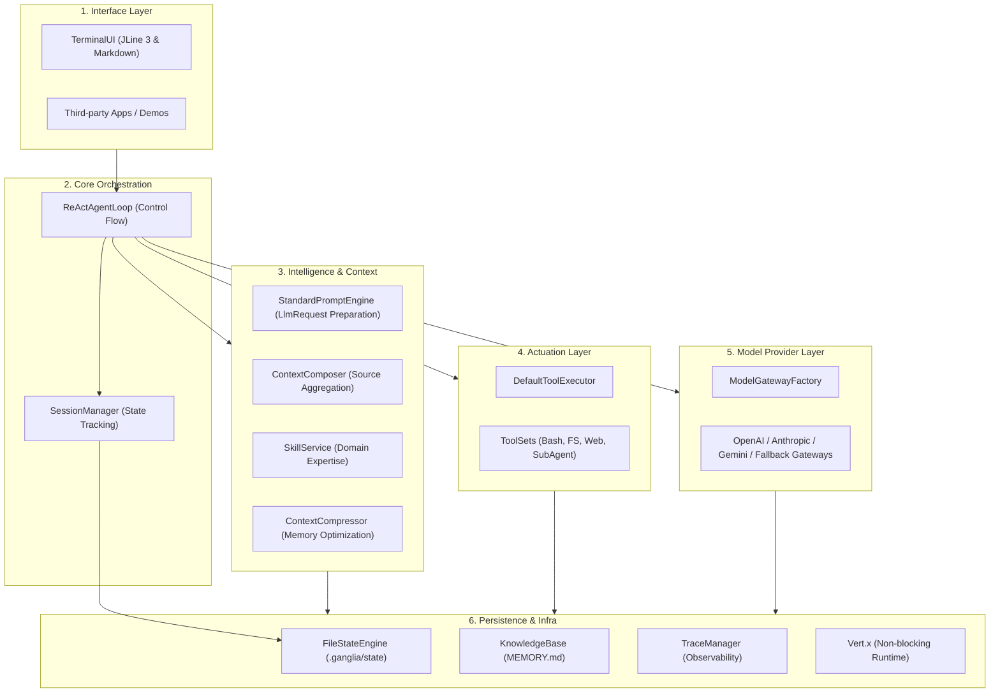
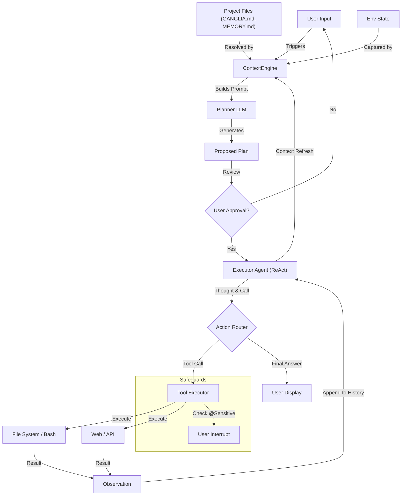

# Ganglia Architecture Documentation

> **Status:** Implemented
> **Version:** 1.0.0

## 1. System Overview

**Ganglia** is a Java-based Agent framework designed for integration into third-party applications. It prioritizes **simplicity, robustness, and transparency** over complex, opaque multi-agent graphs.

The core design philosophy is inspired by **Claude Code**: a single, powerful control loop that utilizes a hybrid toolset and a transparent, file-based memory system.

## 2. Core Design Principles

1.  **Single Control Loop (The "ReAct" Loop):**
    - Avoid complex graphs or state machines for the core reasoning.
    - Use a flat message history processed by a single main loop.
    - Flow: `Input -> [Thought -> Tool -> Observation] * N -> Answer`.

2.  **Tool-First Navigation:**
    - The agent explores codebases using tools (`grep`, `glob`, `read`) rather than relying purely on pre-computed embeddings.
    - "Agentic Search" allows the model to form its own queries and refine them based on feedback.

3.  **Memory as Code:**
    - Memory is stored in **Markdown files** (`MEMORY.md`, Daily Records) within the project.
    - It is transparent, editable, and version-controlled.

4.  **Steerability via Prompting:**
    - Behavior is controlled by extensive, structured prompts (XML, ContextSources) rather than hard-coded logic.
    - Core mandates are managed via [Core Guidelines](CORE_GUIDELINES_DESIGN.md) (`GANGLIA.md`).

## 3. Logical Architecture

### 3.0 Layered Architecture

The system is organized into distinct layers to ensure modularity.

### 3.1 The Model Layer ("The Brain")

- **Unified Interface:** `ModelGateway` abstracts providers (OpenAI, Anthropic, Gemini).
- **Low-Latency Streaming:** 
  - Uses `chatStream` to provide real-time feedback via the Vert.x EventBus.
  - Thoughts and content are streamed while tool calls are accumulated.
- **Robustness:** `FallbackModelGateway` provides automatic downgrade to utility models if the primary model fails.
- **Testing:** `StubModelGateway` and `E2ETestHarness` allow for deterministic E2E simulation without real LLM calls.

### 3.2 Tooling & Actuation ("The Hands")
- **Definition:** Tools are Java classes implementing `ToolSet`.
- **Hybrid Toolset:**
  - **Bash/FS:** Native commands and non-blocking Java FileSystem tools.
  - **Contextual:** ToDo management, KnowledgeBase interaction.
  - **Interaction:** `ask_selection` for human-in-the-loop.
- **Safety:**
  - **Output Limits:** 64KB per tool call.
  - **Pagination:** `read_file` supports `offset` and `limit`.
  - **Sanitization:** `PathSanitizer` prevents directory traversal.

### 3.3 The Memory System

- **Three-Tier Architecture:**
    - **Short-Term (Turn):** Raw interaction details.
    - **Medium-Term (Session):** Managed via `ContextCompressor`.
    - **Daily Journal:** Cross-session summaries in `.ganglia/memory/daily-*.md`.
    - **Long-Term (Project):** `MEMORY.md`.

### 3.4 Skill System ("The Expertise")

- **Hybrid Loading:** Supports script-based skills (folder) and JAR-based skills (dynamically loaded).
- **Isolation:** JAR skills use dedicated ClassLoaders to prevent dependency conflicts.

### 3.5 Context Management Engine

- **Source-based Composition:** `ContextComposer` aggregates `ContextSource` implementations (Persona, Environment, Tools, Skills, etc.).
- **Prioritized Stacking:** Fragments are merged based on priority (1-10).
- **Token Pruning:** `StandardPromptEngine` handles history pruning and context window management.

## 4. Interface & Interaction

- **Rich Terminal UI:** Powered by **JLine 3**, providing multiline input, syntax highlighting, and a sticky status bar.
- **Markdown Rendering:** Integrated **flexmark** for ANSI-rendered Markdown output (bold, italics, code blocks, lists).
- **E2E Simulation:** A declarative `TestScenario` framework for verifying complex agent behaviors via the `E2ETestHarness`.

## 5. Human-in-the-Loop & Interaction

Ganglia employs a **"Plan First, Act Later"** philosophy to ensure user control over complex tasks, alongside runtime safeguards.

### 4.1 The "Plan First" Pattern (Architectural)

Before executing complex requests, the system enters a **Planning Phase**:

1.  **Decomposition:** A specialized "Planner" LLM instance analyzes the request and generates a structured JSON plan (`List<Step>`).
2.  **Review:** The plan is presented to the user for approval or modification.
3.  **Execution:** Only approved steps are fed into the ReAct Executor's To-Do list.

### 4.2 Runtime Interrupts (Tool-Based)

- **Sensitive Tools:** Tools marked as `@Sensitive` (e.g., `delete_file`, `deploy`) automatically trigger a **User Confirmation** interrupt.
- **`ask_selection` Tool:** The agent can explicitly invoke this tool to resolve ambiguities or request input (supports `text` and `choice` modes).
- **Execution Pause:** The ReAct loop suspends state and awaits user input before resuming.

## 6. Data Flow (ReAct Loop)

## 7. Technology Stack

- **Language:** Java 17+
- **Core Framework:** Vert.x (Reactive, Non-blocking I/O)
- **UI & Rendering:** JLine 3, Flexmark
- **LLM Client:** OpenAI-Java (Official) 
- **Observability:** OpenTelemetry
- **Testing:** JUnit 5, E2E Simulation Harness
