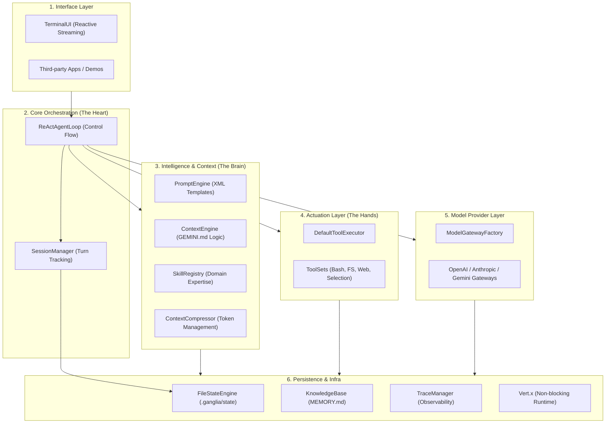
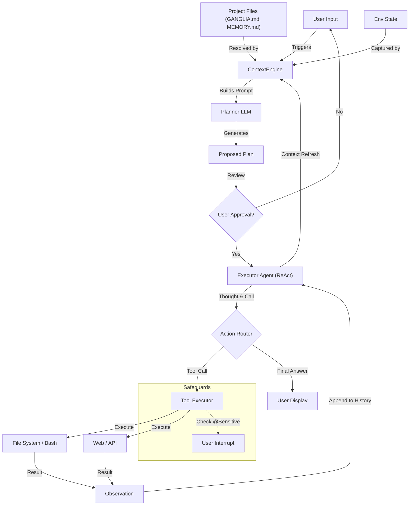

# Ganglia Architecture Documentation

> **Status:** Draft / Initial Design
> **Version:** 0.1.0

## 1. System Overview

**Ganglia** is a Java-based Agent framework designed for integration into third-party applications. It prioritizes **simplicity, robustness, and transparency** over complex, opaque multi-agent graphs.

The core design philosophy is inspired by **Claude Code**: a single, powerful control loop that utilizes a hybrid toolset and a transparent, file-based memory system.

## 2. Core Design Principles

1.  **Single Control Loop (The "ReAct" Loop):**
    - Avoid complex graphs or state machines.
    - Use a flat message history processed by a single main thread.
    - Flow: `Input -> [Thought -> Tool -> Observation] * N -> Answer`.

2.  **Tool-First Navigation:**
    - The agent explores codebases using tools (`grep`, `glob`, `read`) rather than relying on pre-computed, opaque vector embeddings (RAG).
    - "Agentic Search" allows the model to form its own queries and refine them based on feedback.

3.  **Memory as Code:**
    - Memory is stored in **Markdown files** (`MEMORY.md`, Session Logs) within the user's project.
    - It is transparent, editable, and version-controlled by Git.

4.  **Steerability via Prompting:**
    - Behavior is controlled by extensive, structured prompts (XML, Examples) rather than hard-coded logic.
    - Adherence to "System Reminders" and "Tone" guidelines.
    - Core mandates are managed via [Core Guidelines](CORE_GUIDELINES_DESIGN.md) (`GANGLIA.md`).

## 3. Logical Architecture

### 3.0 Layered Architecture (Overview)

The system is organized into distinct layers to ensure modularity and ease of integration for new LLM providers or tools.

### 3.1 The Model Layer ("The Brain")

- **Unified Interface:** Abstractions (`ModelProvider`, `ChatClient`) hide the specifics of LLM providers (OpenAI, Anthropic, etc.).
- **Low-Latency Streaming:** 
  - Uses `chatStream` to provide real-time feedback to the user via the Vert.x EventBus.
  - The reasoning process ("Thoughts") is streamed to the UI as it's generated, while the full response is accumulated internally for tool execution.
- **Smart Routing:**
  - **Fast Model (e.g., Haiku):** Handles routine tasks like file summarization, git history reading, and token counting.
  - **Smart Model (e.g., GPT-4o, Sonnet):** Handles the main ReAct loop, reasoning, and planning.
- **Streaming:** Built on Java Flow API / Reactor for real-time user feedback.

### 3.2 Tooling & Actuation ("The Hands")
- **Definition:** Tools are defined via Java classes implementing `ToolSet`.
- **Hybrid Toolset:**
  - **Low-Level:** `Bash` execution (via `BashTools`), `write_file` (Atomic).
  - **High-Level:** `grep_search`, `glob`, `Edit` (Smart code replacement), `web_fetch` (via Vert.x WebClient).
- **Structured Error Handling:** Tools return a `ToolInvokeResult`.
- **Safety:**
  - **Sandbox:** Execution of untrusted code in isolated environments.
  - **Memory Protection:** Built-in safeguards to prevent memory exhaustion from large tool outputs (e.g., 64KB limit per call).
  - **Line-based Pagination:** Direct file read tools (`read_file`) support `offset` and `limit` to handle large files without overflow.
  - **Human-in-the-Loop:** Tools marked as "Sensitive" (or explicit `ask_selection` calls) require user interaction.

### 3.3 The Memory System

See [Memory Architecture](MEMORY_ARCHITECTURE.md) for details.

- **Three-Tier Architecture (Expanded):**
    - **Short-Term (Turn):** High-fidelity execution details.
    - **Medium-Term (Session):** Managed via **Proactive Context Compression** (triggered at 70% of the model's window).
    - **Daily Journal (Bridge):** Cross-session summaries stored in `.ganglia/memory/daily-*.md`.
    - **Long-Term (Project):** Curated `MEMORY.md` and archived logs.
- **Retrieval:** Agentic Search (`grep`, `read`) over long-term memory.
- **Injection:** Relevant memory fragments are injected into the active prompt by the **ContextEngine** (Priority 10).

### 3.4 Workflow Management

- **To-Do List:** The agent maintains a self-managed task list to prevent getting lost in long sessions.
- **Cloning (Transient Delegation):**
  - For complex sub-tasks, the agent can spawn a "clone" (a fresh instance with specific context).
  - The clone performs the task and returns the result as a tool output.
  - This keeps the main context window clean.
  - See [Sub-Agent Design](SUB_AGENT_DESIGN.md) for implementation details.

### 3.5 Skill System ("The Expertise")

- **Modularity:** Industry or domain-specific knowledge and tools are packaged as "Skills".
- **Dynamic Activation:** Skills can be activated/deactivated per session, keeping the base system prompt focused.
- **Context Injection:** Active skills inject specialized guidelines and register domain-specific tools into the loop.

### 3.6 Context Management Engine (ContextEngine)

The **ContextEngine** is responsible for the systematic construction of the LLM system prompt. It ensures that the agent always has the most relevant information while staying within token limits.

- **Layered Construction:** Stacks context fragments (Persona, Mandates, Environment, Skills, Plan, Memory) based on a strict priority hierarchy (1-10).
- **Decoupled Resolution:** Uses `ContextResolver` to fetch data from static files (`GANGLIA.md`), dynamic state (ToDo lists), and semantic memory.
- **Intelligent Pruning:** When the token limit is approached, the `ContextComposer` prunes lower-priority fragments (like historical memory) while preserving "Prime Directives" (Persona and Mandates).

## 4. Human-in-the-Loop & Interaction

Ganglia employs a **"Plan First, Act Later"** philosophy to ensure user control over complex tasks, alongside runtime safeguards.

### 4.1 The "Plan First" Pattern (Architectural)

Before executing complex requests, the system enters a **Planning Phase**:

1.  **Decomposition:** A specialized "Planner" LLM instance analyzes the request and generates a structured JSON plan (`List<Step>`).
2.  **Review:** The plan is presented to the user for approval or modification.
3.  **Execution:** Only approved steps are fed into the ReAct Executor's To-Do list.

### 4.2 Runtime Interrupts (Tool-Based)

- **Sensitive Tools:** Tools marked as `@Sensitive` (e.g., `delete_file`, `deploy`) automatically trigger a **User Confirmation** interrupt.
- **`ask_selection` Tool:** The agent can explicitly invoke this tool to resolve ambiguities or request input (supports `text` and `choice` modes).
- **Execution Pause:** The ReAct loop suspends state and awaits user input before resuming.

## 5. Data Flow (ReAct Loop)

## 6. Technology Stack

- **Language:** Java 17+
- **Core Framework:** Vert.x (Reactive, Non-blocking I/O)
- **LLM Client:** OpenAI-Java (Official) 
- **Observability:** OpenTelemetry
- **Testing:** JUnit 5
