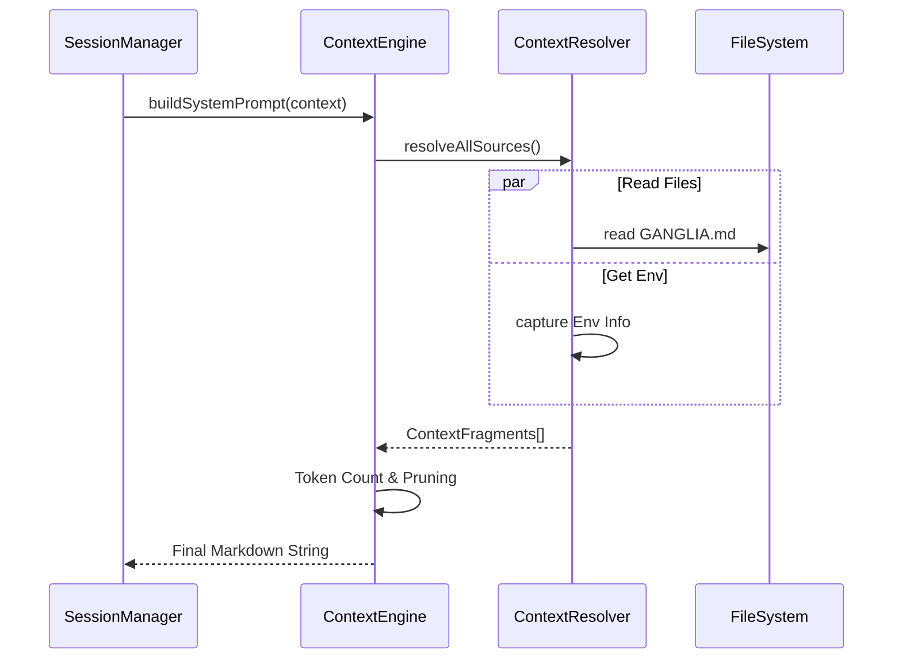

# Ganglia Context Management Architecture Design (ContextEngine)

> **Status**: Initial Design
> **Module**: `ganglia-core` (Prompt Enhancement)
> **Related**: [Architecture](ARCHITECTURE.md), [Core Guidelines](CORE_GUIDELINES_DESIGN.md)

## 1. Objective
Inspired by the `GEMINI.md` mechanism, provide a transparent, editable, and layered context construction system. Systematically build prompts by decoupling project specifications, operational rules, real-time status, and domain knowledge.

## 2. Core Components

### 2.1 `ContextSource`
Defines the interface for context origins.
- **StaticSource**: Markdown files in the project root (e.g., `GANGLIA.md`, `ARCHITECTURE.md`).
- **DynamicSource**: Runtime state such as `ToDoList` and `SessionHistory`.
- **SemanticSource**: Semantic fragments retrieved from `MEMORY.md`.
- **EnvironmentSource**: System information (OS, Java Version, Directory Structure snapshot).

### 2.2 `ContextResolver`
Responsible for transforming `ContextSource` into standardized `ContextFragments`.
- **Header Parsing**: Supports splitting file fragments based on Markdown H2 headers (`##`).
- **Variable Replacement**: Supports variable injection like `${project.name}`.

### 2.3 `ContextComposer`
The core engine responsible for combining fragments based on priority and templates.
- **Priority Management**: Assigns a priority (1-10) to each fragment.
- **Token Pruning**: When total tokens exceed the model's window (targeted at 2000 tokens for system prompt), non-mandatory fragments are pruned from lowest to highest priority.
- **Safety Truncation**: A final hard-truncation check ensures the composed prompt never overflows the model's budget.

## 3. Context Hierarchy

The system prompt is constructed by stacking fragments according to their priority. Lower priority numbers indicate "Core" instructions that are essential for the agent's identity and safety.

| Priority | Module Name | Role | Source |
| :--- | :--- | :--- | :--- |
| 1 | **Persona** | **Who am I?** (Agent identity and tone) | Core Config |
| 2 | **Mandates** | **What are my hard rules?** (Operational & Safety prohibitions) | `GANGLIA.md` [Mandates] |
| 3 | **Project Context** | **What tech am I using?** (Coding standards and project-specific knowledge) | `GANGLIA.md` [Context] |
| 4 | **Environment** | **Where am I?** (OS, working directory, and tree snapshot) | System Calls |
| 5 | **Active Skills** | **What are my specialties?** (Expertise-specific heuristics) | `SkillRegistry` |
| 6 | **Current Plan** | **What is the goal?** (Task decomposition and current progress) | Derived from User Task |
| 10 | **Memory** | **What have I learned?** (Historical fragments from semantic search) | `MEMORY.md` |

### 3.1 Role of the User Task
The **User Task** (initial input) serves as the catalyst for the entire hierarchy. 
1. **Input**: User submits a raw request (e.g., "Fix the bug in Main").
2. **Decomposition**: The agent (or a planner) translates this request into a structured **ToDo List**.
3. **Injection**: This plan is injected at **Priority 6**, ensuring the agent maintains "Goal Awareness" even if the conversation history grows very long.

### 3.2 Token Pruning Logic
When the combined context exceeds the model's token limit, the `ContextComposer` applies a **bottom-up pruning** strategy:
- **Volatile Context**: Memory (Priority 10) is the first to be removed.
- **Operational Context**: Level 4-6 (Environment, Skills, Plan) are trimmed or summarized if necessary.
- **The "Prime Directives"**: Persona and Mandates (Priority 1-2) are **never** pruned, ensuring the agent remains safe and stays within its defined operational boundaries.

## 4. Interaction Sequence



## 5. Configuration Example (`GANGLIA.md`)

```markdown
# Ganglia Project Context

## [Operational Mandates]
- Always prioritize non-blocking Vert.x APIs.
- Never modify the `.git` directory.

## [Project Conventions]
- Use Java 17 Records for DTOs.
- All asynchronous operations must return `io.vertx.core.Future`.
```