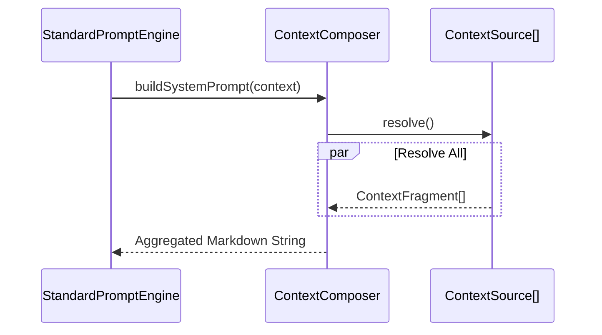
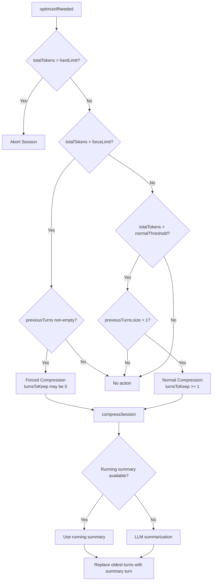

# Ganglia Context Management Architecture

> **Status:** In Development
> **Version:** 0.1.7-SNAPSHOT
>
> **Module**: `ganglia-harness` (Prompt Enhancement)
> **Related**: [Architecture](ARCHITECTURE.md), [Core Guidelines](CORE_GUIDELINES_DESIGN.md)

## 1. Objective

Provide a transparent, editable, and layered context construction system. Systematically build prompts by decoupling project specifications, operational rules, real-time status, and domain knowledge.

## 2. Core Components

### 2.1 `ContextSource` (Interface)

Defines the interface for context origins.
- **`FileContextSource`**: Markdown files in the project root (e.g., `GANGLIA.md`, `ARCHITECTURE.md`).
- **`ToDoContextSource`**: Runtime state from the `ToDoList`.
- **`MemoryContextSource`**: Semantic fragments from `.ganglia/memory/MEMORY.md`.
- **`EnvironmentSource`**: System information (OS, Java Version, Directory Structure snapshot).
- **`SkillContextSource`**: Injects specialized guidelines from active skills.
- **`ToolContextSource`**: Injects tool definitions and usage instructions.

### 2.2 `ContextResolver`

Responsible for transforming raw data into standardized `ContextFragment` objects.
- **`MarkdownContextResolver`**: Supports splitting file fragments based on Markdown H2 headers (`##`).

### 2.3 `ContextComposer`

The core engine responsible for combining fragments based on priority.
- **Priority Management**: Assigns a priority (1-10) to each fragment.
- **Budgeting**: Provides the `StandardPromptEngine` with fragments to be assembled into the final prompt.

## 3. Context Hierarchy (5-Layer Model)

The system prompt is constructed by stacking fragments into 5 conceptual layers. We distinguish between **Static Rules** (Mandatory, never pruned) and **Dynamic State** (Prunable, removed bottom-up if budget exceeded).

### 3.1 Mandatory Layers (The "Soul" - Never Pruned)

These fragments define the agent's identity, core rules, and operational methods.

| Layer          | Priority | Source Type    | Role                                   | Implementation           |
|:---------------|:---------|:---------------|:---------------------------------------|:-------------------------|
| **1. Kernel**  | 10       | **Persona**    | **Who am I?** (Identity and tone)      | `PersonaContextSource`   |
|                | 11       | **Mandates**   | **What are my hard rules?**            | `MandatesContextSource`  |
| **2. Process** | 20       | **Workflow**   | **How do I work?** (R-S-E lifecycle)   | `WorkflowContextSource`  |
| **3. Rule**    | 21       | **Guidelines** | **What are my operational standards?** | `GuidelineContextSource` |
|                | 22       | **Tools**      | **How do I use my tools?**             | `ToolContextSource`      |

### 3.2 Prunable Layers (The "World" - Bottom-Up Pruning)

These fragments represent the agent's current knowledge of the world and its tasks. They can be removed to fit the token budget, starting from the highest priority number (e.g., Memory is pruned first).

| Layer             | Priority | Source Type      | Role                                                 | Implementation        |
|:------------------|:---------|:-----------------|:-----------------------------------------------------|:----------------------|
| **4. Capability** | 40       | **Skills**       | **What are my specialties?**                         | `SkillContextSource`  |
| **5. Context**    | 50       | **Environment**  | **Where am I?** (System, path, structure)            | `EnvironmentSource`   |
|                   | 51       | **Current Plan** | **What is the goal?** (ToDo list)                    | `ToDoContextSource`   |
|                   | 60       | **Memory**       | **What have I learned?** (.ganglia/memory/MEMORY.md) | `MemoryContextSource` |

## 4. Implementation Detail: Token Pruning

The `StandardPromptEngine` applies a **bottom-up pruning** strategy when total tokens exceed the model's window:
- **Volatile Context**: Context and Capability fragments (Priority 40-60) are pruned starting from the highest number (e.g., Memory @ 60 is the first to go).
- **Prime Directives**: Layers 1-3 (Priority 10-22) are marked as `Mandatory` and are **never** pruned by the composer.
- **History Pruning**: Conversation history is pruned independently to fit within the `historyTokenWindow` (e.g., 4000 tokens).

## 5. Context Compression (History Optimization)

When conversation history grows beyond the model's context window, the `DefaultContextOptimizer` applies a three-tier compression strategy. All thresholds are derived from the model's `contextLimit`, making them automatically scale across different model sizes.

### 5.1 Three-Tier Threshold Model

```
Tier 1: Normal Compression     contextLimit × compressionThreshold (default 0.7)
Tier 2: Forced Compression     contextLimit × forceCompressionMultiplier (default 3.0)
Tier 3: Hard Limit (Abort)     contextLimit × hardLimitMultiplier (default 4.0)
```

**Example thresholds by model size:**

| Model         | contextLimit | Normal (×0.7) | Forced (×3.0) | Hard Limit (×4.0) |
|:--------------|:-------------|:--------------|:--------------|:------------------|
| GPT-4o-mini   | 32,000       | 22,400        | 96,000        | 128,000           |
| GPT-4o        | 128,000      | 89,600        | 384,000       | 512,000           |
| Claude Sonnet | 200,000      | 140,000       | 600,000       | 800,000           |

### 5.2 Tier Behavior

| Tier           | Trigger Condition                                         | Guard                      | Behavior                                                                                               |
|:---------------|:----------------------------------------------------------|:---------------------------|:-------------------------------------------------------------------------------------------------------|
| **Normal**     | `totalTokens > contextLimit × compressionThreshold`       | `previousTurns.size() > 1` | Compresses oldest turns into a summary, keeps at least 1 turn                                          |
| **Forced**     | `totalTokens > contextLimit × forceCompressionMultiplier` | `previousTurns` non-empty  | Aggressive compression — `turnsToKeep` may be 0, replacing even a single oversized turn with a summary |
| **Hard Limit** | `totalTokens > contextLimit × hardLimitMultiplier`        | None                       | Session aborted with error. Financial guardrail preventing runaway token costs                         |

The **Forced Compression** tier exists to close a blind spot: a single large turn that bypasses the Normal tier's `previousTurns.size() > 1` guard could otherwise grow unchecked until it hits the Hard Limit.

### 5.3 Compression Target

After compression, the optimizer targets **50%** of the available budget (or `ContextBudget.compressionTarget()` if provided) to leave room for new interactions. Turns are kept from most-recent to oldest until the budget is exhausted.

If a running summary is available (from incremental `extractKeyFacts` during the session), it is used directly, avoiding an additional LLM summarization call.

### 5.4 Configuration

Compression thresholds are configurable in `ganglia.json` under the `agent` block:

```json
{
  "agent": {
    "compressionThreshold": 0.7,
    "forceCompressionMultiplier": 3.0,
    "hardLimitMultiplier": 4.0,
    "systemOverheadTokens": 6000
  }
}
```

| Key                          | Type   | Default | Description                                                                                                                       |
|:-----------------------------|:-------|:--------|:----------------------------------------------------------------------------------------------------------------------------------|
| `compressionThreshold`       | double | 0.7     | Fraction of `contextLimit` at which normal compression triggers                                                                   |
| `forceCompressionMultiplier` | double | 3.0     | Multiplier of `contextLimit` for forced compression                                                                               |
| `hardLimitMultiplier`        | double | 4.0     | Multiplier of `contextLimit` for session abort                                                                                    |
| `systemOverheadTokens`       | int    | 6000    | Estimated tokens for system prompt + tool definitions + protocol framing, added to history token count when evaluating thresholds |

Most deployments do not need to change these values. The defaults are designed to work well across common model sizes (32k–200k context windows).

### 5.5 Implementation Classes

| Class                     | Package                         | Responsibility                                                                          |
|:--------------------------|:--------------------------------|:----------------------------------------------------------------------------------------|
| `DefaultContextOptimizer` | `infrastructure.internal.state` | Orchestrates the three-tier compression logic                                           |
| `ContextBudget`           | `port.internal.prompt`          | Centralizes token budget calculations (history, currentTurn, compressionTarget)         |
| `AgentConfigProvider`     | `config`                        | Provides `getForceCompressionMultiplier()` and `getHardLimitMultiplier()` with defaults |
| `ContextCompressor`       | `port.internal.memory`          | SPI for LLM-based turn summarization                                                    |

## 6. Sequence Diagrams

### 6.1 Prompt Construction



### 6.2 Context Compression



