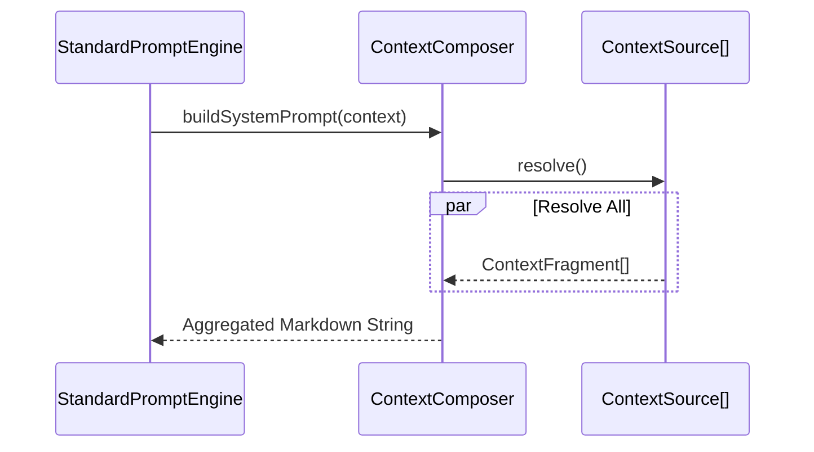

# Ganglia Context Management Architecture

> **Status:** In Development
> **Version:** 0.1.5
>
> **Module**: `ganglia-harness` (Prompt Enhancement)
> **Related**: [Architecture](ARCHITECTURE.md), [Core Guidelines](CORE_GUIDELINES_DESIGN.md)

## 1. Objective

Provide a transparent, editable, and layered context construction system. Systematically build prompts by decoupling project specifications, operational rules, real-time status, and domain knowledge.

## 2. Core Components

### 2.1 `ContextSource` (Interface)

Defines the interface for context origins.
- **`FileContextSource`**: Markdown files in the project root (e.g., `GANGLIA.md`, `ARCHITECTURE.md`).
- **`ToDoContextSource`**: Runtime state from the `ToDoList`.
- **`MemoryContextSource`**: Semantic fragments from `.ganglia/memory/MEMORY.md`.
- **`EnvironmentSource`**: System information (OS, Java Version, Directory Structure snapshot).
- **`SkillContextSource`**: Injects specialized guidelines from active skills.
- **`ToolContextSource`**: Injects tool definitions and usage instructions.

### 2.2 `ContextResolver`

Responsible for transforming raw data into standardized `ContextFragment` objects.
- **`MarkdownContextResolver`**: Supports splitting file fragments based on Markdown H2 headers (`##`).

### 2.3 `ContextComposer`

The core engine responsible for combining fragments based on priority.
- **Priority Management**: Assigns a priority (1-10) to each fragment.
- **Budgeting**: Provides the `StandardPromptEngine` with fragments to be assembled into the final prompt.

## 3. Context Hierarchy (5-Layer Model)

The system prompt is constructed by stacking fragments into 5 conceptual layers. We distinguish between **Static Rules** (Mandatory, never pruned) and **Dynamic State** (Prunable, removed bottom-up if budget exceeded).

### 3.1 Mandatory Layers (The "Soul" - Never Pruned)

These fragments define the agent's identity, core rules, and operational methods.

| Layer          | Priority | Source Type    | Role                                   | Implementation           |
|:---------------|:---------|:---------------|:---------------------------------------|:-------------------------|
| **1. Kernel**  | 10       | **Persona**    | **Who am I?** (Identity and tone)      | `PersonaContextSource`   |
|                | 11       | **Mandates**   | **What are my hard rules?**            | `MandatesContextSource`  |
| **2. Process** | 20       | **Workflow**   | **How do I work?** (R-S-E lifecycle)   | `WorkflowContextSource`  |
| **3. Rule**    | 21       | **Guidelines** | **What are my operational standards?** | `GuidelineContextSource` |
|                | 22       | **Tools**      | **How do I use my tools?**             | `ToolContextSource`      |

### 3.2 Prunable Layers (The "World" - Bottom-Up Pruning)

These fragments represent the agent's current knowledge of the world and its tasks. They can be removed to fit the token budget, starting from the highest priority number (e.g., Memory is pruned first).

| Layer             | Priority | Source Type      | Role                                                 | Implementation        |
|:------------------|:---------|:-----------------|:-----------------------------------------------------|:----------------------|
| **4. Capability** | 40       | **Skills**       | **What are my specialties?**                         | `SkillContextSource`  |
| **5. Context**    | 50       | **Environment**  | **Where am I?** (System, path, structure)            | `EnvironmentSource`   |
|                   | 51       | **Current Plan** | **What is the goal?** (ToDo list)                    | `ToDoContextSource`   |
|                   | 60       | **Memory**       | **What have I learned?** (.ganglia/memory/MEMORY.md) | `MemoryContextSource` |

## 4. Implementation Detail: Token Pruning

The `StandardPromptEngine` applies a **bottom-up pruning** strategy when total tokens exceed the model's window:
- **Volatile Context**: Context and Capability fragments (Priority 40-60) are pruned starting from the highest number (e.g., Memory @ 60 is the first to go).
- **Prime Directives**: Layers 1-3 (Priority 10-22) are marked as `Mandatory` and are **never** pruned by the composer.
- **History Pruning**: Conversation history is pruned independently to fit within the `historyTokenWindow` (e.g., 4000 tokens).

## 5. Sequence Diagram

