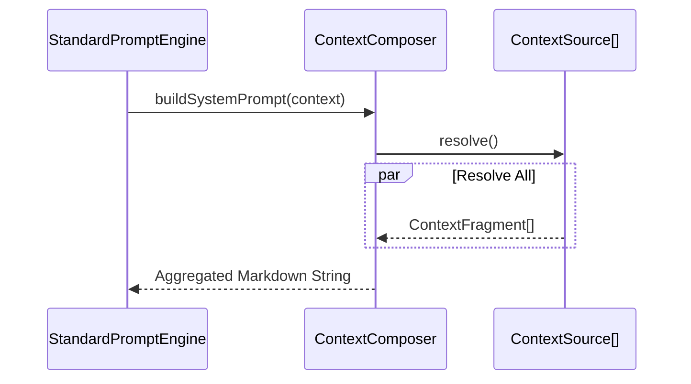

# Ganglia Context Management Architecture (Implemented)

> **Status**: Implemented
> **Module**: `ganglia-core` (Prompt Enhancement)
> **Related**: [Architecture](ARCHITECTURE.md), [Core Guidelines](CORE_GUIDELINES_DESIGN.md)

## 1. Objective
Provide a transparent, editable, and layered context construction system. Systematically build prompts by decoupling project specifications, operational rules, real-time status, and domain knowledge.

## 2. Core Components

### 2.1 `ContextSource` (Interface)
Defines the interface for context origins.
- **`FileContextSource`**: Markdown files in the project root (e.g., `GANGLIA.md`, `ARCHITECTURE.md`).
- **`ToDoContextSource`**: Runtime state from the `ToDoList`.
- **`MemoryContextSource`**: Semantic fragments from `MEMORY.md`.
- **`EnvironmentSource`**: System information (OS, Java Version, Directory Structure snapshot).
- **`SkillContextSource`**: Injects specialized guidelines from active skills.
- **`ToolContextSource`**: Injects tool definitions and usage instructions.

### 2.2 `ContextResolver`
Responsible for transforming raw data into standardized `ContextFragment` objects.
- **`MarkdownContextResolver`**: Supports splitting file fragments based on Markdown H2 headers (`##`).

### 2.3 `ContextComposer`
The core engine responsible for combining fragments based on priority.
- **Priority Management**: Assigns a priority (1-10) to each fragment.
- **Budgeting**: Provides the `StandardPromptEngine` with fragments to be assembled into the final prompt.

## 3. Context Hierarchy

The system prompt is constructed by stacking fragments according to their priority. Lower priority numbers indicate "Core" instructions that are essential for the agent's identity and safety.

| Priority | Source Type | Role | Implementation |
| :--- | :--- | :--- | :--- |
| 1 | **Persona** | **Who am I?** (Identity and tone) | `PersonaContextSource` |
| 2 | **Mandates** | **What are my hard rules?** | `FileContextSource` (GANGLIA.md [Mandates]) |
| 3 | **Project Context** | **What tech am I using?** | `FileContextSource` (GANGLIA.md [Context]) |
| 4 | **Environment** | **Where am I?** | `EnvironmentSource` |
| 5 | **Active Skills** | **What are my specialties?** | `SkillContextSource` |
| 6 | **Current Plan** | **What is the goal?** | `ToDoContextSource` |
| 10 | **Memory** | **What have I learned?** | `MemoryContextSource` |

## 4. Implementation Detail: Token Pruning
The `StandardPromptEngine` applies a **bottom-up pruning** strategy when total tokens exceed the model's window:
- **Volatile Context**: Memory (Priority 10) is the first to be removed.
- **Prime Directives**: Persona and Mandates (Priority 1-2) are **never** pruned.
- **History Pruning**: Conversation history is pruned independently to fit within the `historyTokenWindow` (e.g., 4000 tokens).

## 5. Sequence Diagram

