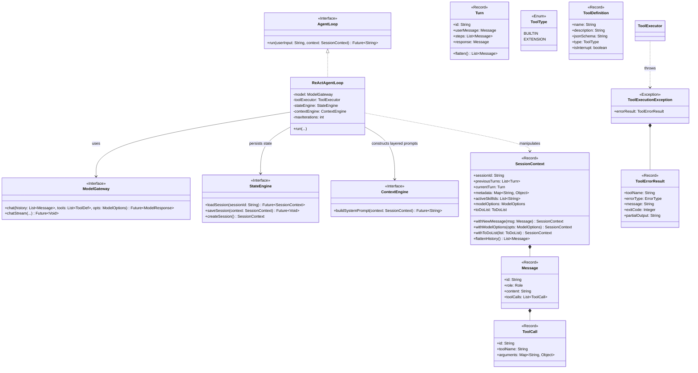
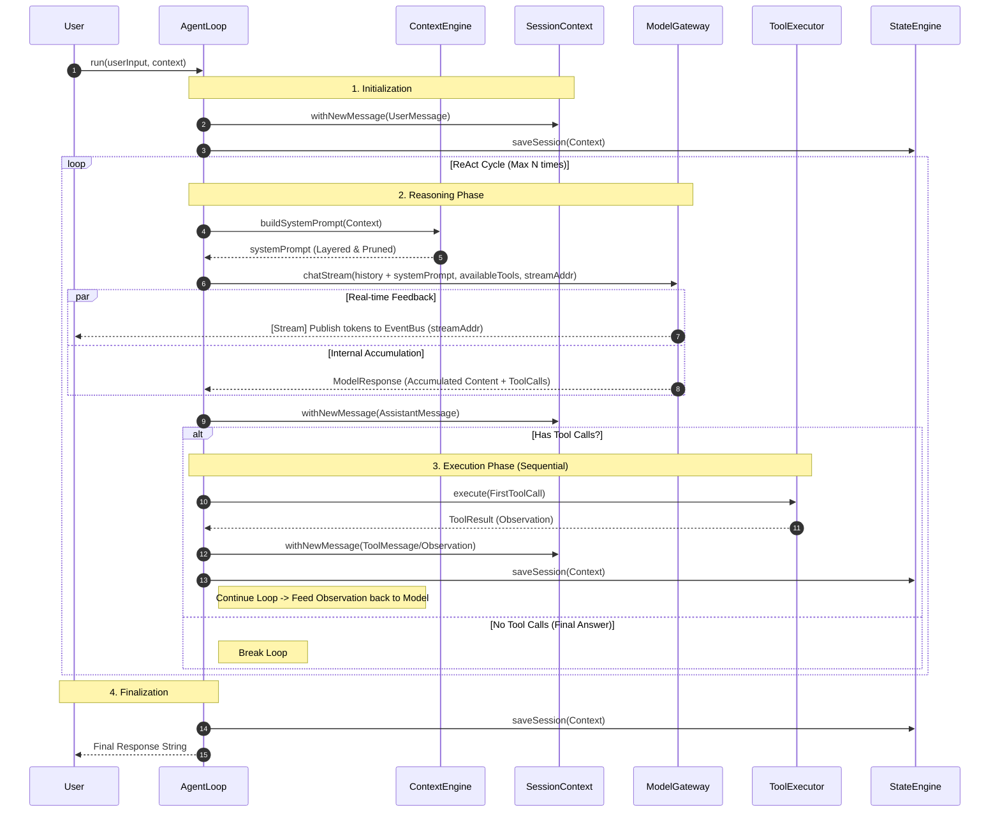
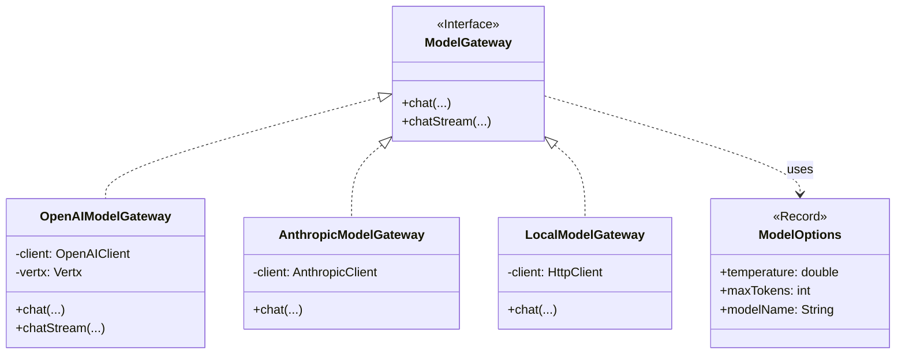

# Ganglia Core Kernel Design

> **Module:** `ganglia-core`
> **Status:** Detailed Design (UML & Sequence)
> **Package:** `me.stream.ganglia.core`

This document outlines the detailed design for the Core Kernel module using UML and Sequence diagrams.

## 1. Class Diagram: Core Components

This diagram illustrates the relationships between the main entities: `AgentLoop`, `ModelGateway`, `StateEngine`, and the Domain Models.

## 2. Sequence Diagram: The ReAct Loop

This diagram details the flow of the `AgentLoop.run()` method, demonstrating the cycle of Thought -> Tool -> Observation.

## 3. Class Diagram: Model Abstraction

Detailing the hierarchy for supporting multiple LLM providers.

