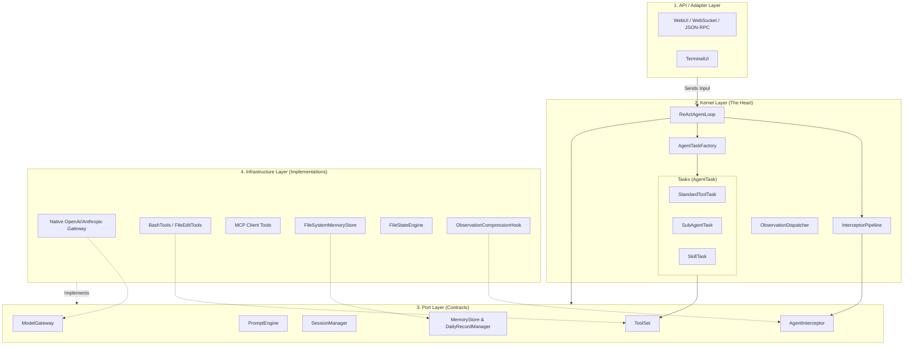
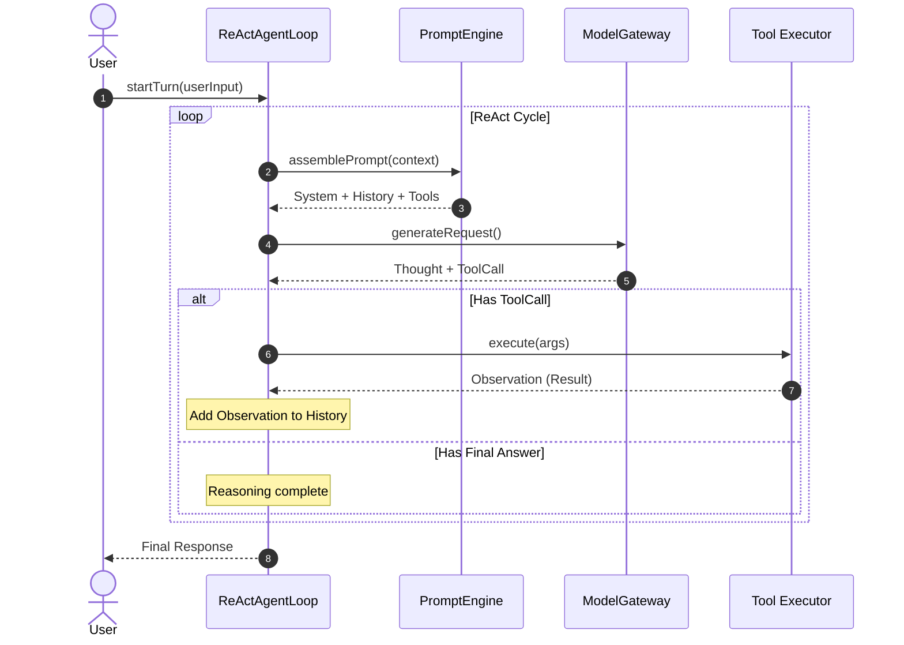
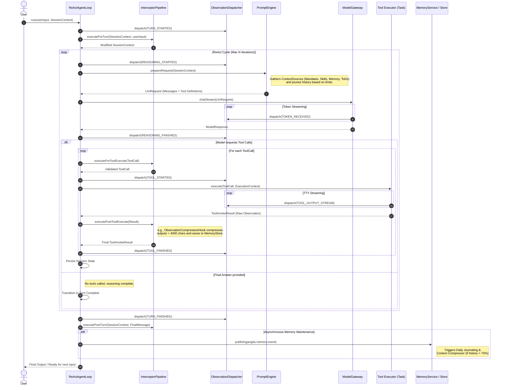

# Ganglia Core: Architecture & Execution Flow

> **Status:** In Development
> **Version:** 0.1.7-SNAPSHOT

This document provides a comprehensive overview of the structural relationships and the execution sequences of the Ganglia core system.

## 1. Structural Relationship Diagram

Ganglia follows a strict **Hexagonal (Ports and Adapters) Architecture**. The Kernel handles the pure reasoning logic and orchestrates tasks, interacting with the outside world exclusively through the Port layer. The Infrastructure layer implements these ports, allowing easy swapping of LLM providers, storage mechanisms, and tools.

## 2. Simplified Core Logic Flow

A high-level view of the primary reasoning cycle, focusing on the core interaction between the Agent, the LLM, and the Tools.

## 3. Complete Execution Sequence Diagram

The following sequence diagram details the full lifecycle of a single user interaction ("Turn"). It highlights the integration of the `InterceptorPipeline`, the `PromptEngine` context assembly, the reasoning loop, tool execution, and memory compression.

