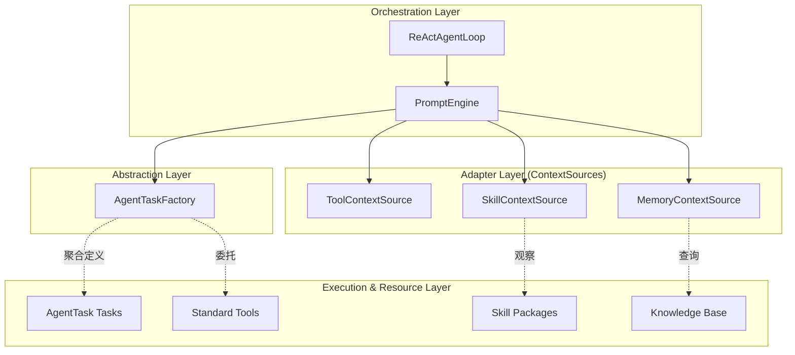

# PromptEngine 与 ContextSource 解耦架构设计

> **Status:** In Development
> **Version:** 0.1.7-SNAPSHOT
>
> **状态:** 已归档
> **版本:** 1.1.0
> **相关:** [Architecture](ARCHITECTURE.md), [Context Engine Design](CONTEXT_ENGINE_DESIGN.md), [Prompt Engine Refactoring](PROMPT_ENGINE_REFACTORING_DESIGN.md)

## 1. 核心设计思想

Ganglia 的提示词构建系统采用了“**观察者-被观察者**”模式的变体，核心目标是确保执行层（Tasks/Tools）和知识层（Skills）与提示词编排层（PromptEngine）完全解耦。

### 1.1 角色定义

* **PromptEngine (编排者/总编)**：面向 `ReActAgentLoop` 的唯一入口。它不生产内容，只负责**策略、调度和组装**。
* **AgentTaskFactory (路由/桥梁)**：**（v1.1.0 新增）** 作为调度抽象层，它聚合了所有的能力定义（ToolDefinitions）。`PromptEngine` 通过它来获取当前 context 下可用的指令列表。
* **ContextSource (适配器/专栏作家)**：领域内容的提供者。它负责将系统状态（如可用工具、激活技能、记忆片段）转化为模型可理解的文本。

## 2. 依赖方向：单向隔离

在这种架构下，依赖关系是单向的，通过 `AgentTaskFactory` 实现了更深层次的解耦。

### 2.1 工具与任务的无感知

`PromptEngine` 不再直接询问 `ToolExecutor` 有哪些工具。它通过 `AgentTaskFactory` 获取定义。这使得 `PromptEngine` 甚至不需要知道它正在为”工具”生成提示词，还是在为”子 Agent”或”技能”生成提示词。

## 3. 架构优势

### 3.1 极高的可测试性 (Testability)

由于提示词引擎只依赖于抽象的 `AgentTaskFactory`，测试时可以轻松 Mock 所有的能力定义，验证提示词的裁剪和组装逻辑。

### 3.2 指令集的动态性

通过 `AgentTaskFactory`，系统可以根据当前的 `SessionContext`（如递归深度、当前 Persona）动态地隐藏或调整某些指令的定义，而无需修改 `PromptEngine` 的核心代码。

## 4. 协作协议：ContextFragment

`PromptEngine` 与 `ContextSource` 之间通过 `ContextFragment` 这一标准协议通信：
1.  **收集**：`PromptEngine` 并行调用所有 `ContextSource`。
2.  **竞争**：各来源返回带有 `priority` (1-10) 的片段。
3.  **仲裁**：`PromptEngine` 根据 Token 预算，按优先级从低到高（数字从小到大）进行强制截断。

## 5. 总结

这种设计确保了 Ganglia 拥有一个**强壮而纯粹的内核**。大脑（PromptEngine）负责统筹全局，`AgentTaskFactory` 负责能力的统一发现，而具体的执行逻辑则隐藏在各个 `AgentTask` 实现中。
