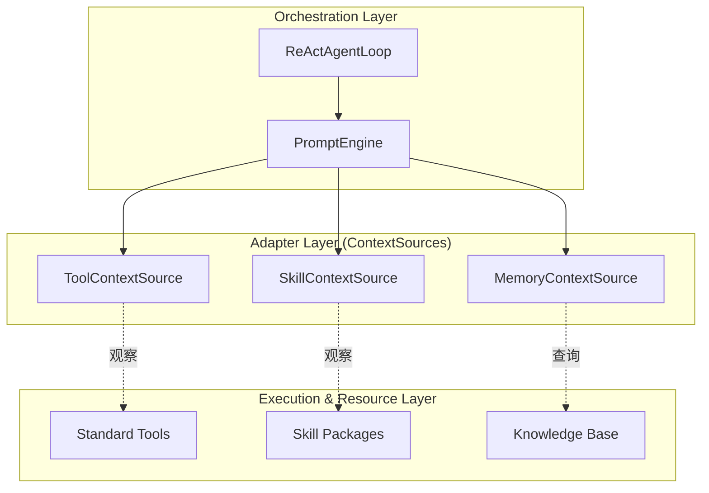

# PromptEngine 与 ContextSource 解耦架构设计

> **状态:** 已归档
> **版本:** 1.0.0
> **相关:** [Architecture](ARCHITECTURE.md), [Context Engine Design](CONTEXT_ENGINE_DESIGN.md), [Prompt Engine Refactoring](PROMPT_ENGINE_REFACTORING_DESIGN.md)

## 1. 核心设计思想

Ganglia 的提示词构建系统采用了“**观察者-被观察者**”模式的变体，核心目标是确保执行层（Tools）和知识层（Skills）与提示词编排层（PromptEngine）完全解耦。

### 1.1 角色定义

*   **PromptEngine (编排者/总编)**：面向 `ReActAgentLoop` 的唯一入口。它不生产内容，只负责**策略、调度和组装**。它决定了 Token 预算的分配优先级和最终 LLM 请求的结构。
*   **ContextSource (适配器/专栏作家)**：领域内容的提供者。它负责将系统状态（如当前工具、激活技能、记忆片段）转化为模型可理解的文本。
*   **Tool/Skill (被观察者)**：纯粹的功能或资源。它们对 `PromptEngine` 的存在“一无所知”。

## 2. 依赖方向：单向隔离

在这种架构下，依赖关系是单向的，这保证了每一层的纯粹性。

### 2.1 工具 (Tools) 的无感知
一个 `Tool` 实现（如 `write_file`）只负责接收参数并执行逻辑。它不需要知道自己是为了哪个 Prompt 服务的，也不需要知道如何向模型描述自己。这种“无知”确保了工具可以在任何非模型环境（如单元测试、普通 CLI）中被直接复用。

### 2.2 技能 (Skills) 的静态性
`Skill` 作为一个资源包，只声明其包含的指令。它不主动注册到 `PromptEngine`，而是等待 `SkillContextSource` 来发现并读取。

## 3. 架构优势

### 3.1 极高的可测试性 (Testability)
由于工具和技能不依赖于复杂的提示词引擎，开发者可以独立于 LLM 编写测试用例。`PromptEngine` 的测试也可以通过 Mock `ContextSource` 来验证 Token 裁剪和组装逻辑。

### 3.2 逻辑隔离与防污染 (Logic Isolation)
防止了提示词逻辑散落在业务代码中。如果工具知道 `PromptEngine`，开发者可能会在工具内部硬编码提示词改写逻辑，导致系统行为不可预测。现在，所有的提示词优化（Prompt Engineering）都集中在各个 `ContextSource` 中。

### 3.3 核心引擎的可插拔性 (Portability)
如果你需要将 Ganglia 的核心控制流从 ReAct 换成 Plan-and-Execute 或其他架构，你只需要保留 `ContextSource` 逻辑，而现有的几百个 `Tool` 和 `Skill` 无需改动一行代码。

## 4. 协作协议：ContextFragment

`PromptEngine` 与 `ContextSource` 之间通过 `ContextFragment` 这一标准协议通信：
1.  **收集**：`PromptEngine` 并行调用所有 `ContextSource`。
2.  **竞争**：各来源返回带有 `priority` (1-10) 的片段。
3.  **仲裁**：`PromptEngine` 根据 Token 预算，按优先级从低到高（数字从小到大）进行强制截断。

## 5. 总结

这种设计确保了 Ganglia 拥有一个**强壮而纯粹的内核**，以及一个**高度灵活、可扩展的边缘**。大脑（PromptEngine）负责统筹全局，双手（Tools）和专业知识（Skills）负责垂直领域，而 `ContextSource` 则是连接两者的桥梁。
