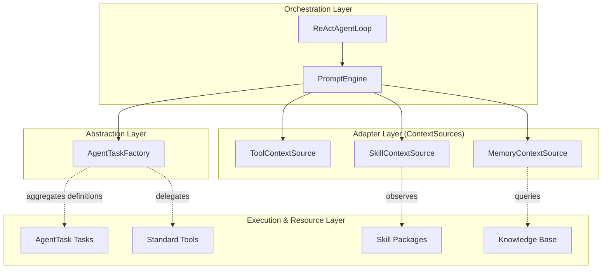

# PromptEngine & ContextSource Decoupling Architecture

> **Status:** In Development
> **Version:** 0.1.7-SNAPSHOT
>
> **Related:** [Architecture](ARCHITECTURE.md), [Context Engine Design](CONTEXT_ENGINE_DESIGN.md), [Prompt Engine Refactoring](PROMPT_ENGINE_REFACTORING_DESIGN.md)

## 1. Core Design Philosophy

Ganglia's prompt construction system uses a variant of the **Observer** pattern. The central goal is to ensure that the execution layer (Tasks/Tools) and the knowledge layer (Skills) are completely decoupled from the prompt orchestration layer (`PromptEngine`).

### 1.1 Role Definitions

* **PromptEngine (Orchestrator)**: The sole entry point facing `ReActAgentLoop`. It does not produce content — it is responsible only for **strategy, scheduling, and assembly**.
* **AgentTaskFactory (Router/Bridge)**: Acts as the scheduling abstraction layer, aggregating all capability definitions (`ToolDefinition`s). `PromptEngine` uses it to retrieve the list of available instructions for the current context.
* **ContextSource (Adapter)**: A domain content provider. It translates system state (e.g., available tools, active skills, memory fragments) into text the model can understand.

## 2. Dependency Direction: Unidirectional Isolation

In this architecture, dependencies flow in a single direction, achieving deeper decoupling through `AgentTaskFactory`.

### 2.1 Tool & Task Transparency

`PromptEngine` no longer queries `ToolExecutor` directly for available tools. It obtains definitions via `AgentTaskFactory`. This means `PromptEngine` does not need to know whether it is generating prompts for a "tool", a "sub-agent", or a "skill".

## 3. Architectural Benefits

### 3.1 High Testability

Because the prompt engine only depends on the abstract `AgentTaskFactory`, all capability definitions can be easily mocked in tests to verify prompt trimming and assembly logic.

### 3.2 Dynamic Instruction Sets

Via `AgentTaskFactory`, the system can dynamically hide or adjust certain instruction definitions based on the current `SessionContext` (e.g., recursion depth, active persona) without modifying the core `PromptEngine` code.

## 4. Collaboration Protocol: ContextFragment

`PromptEngine` and `ContextSource` communicate via the `ContextFragment` standard protocol:
1. **Collect**: `PromptEngine` invokes all `ContextSource` implementations in parallel.
2. **Compete**: Each source returns fragments tagged with a `priority` (1–10).
3. **Arbitrate**: `PromptEngine` enforces truncation by priority (lowest first) when the token budget is exceeded.

## 5. Summary

This design ensures that Ganglia has a **robust and pure kernel**. `PromptEngine` handles overall orchestration, `AgentTaskFactory` is responsible for unified capability discovery, and the concrete execution logic is encapsulated inside each `AgentTask` implementation.
