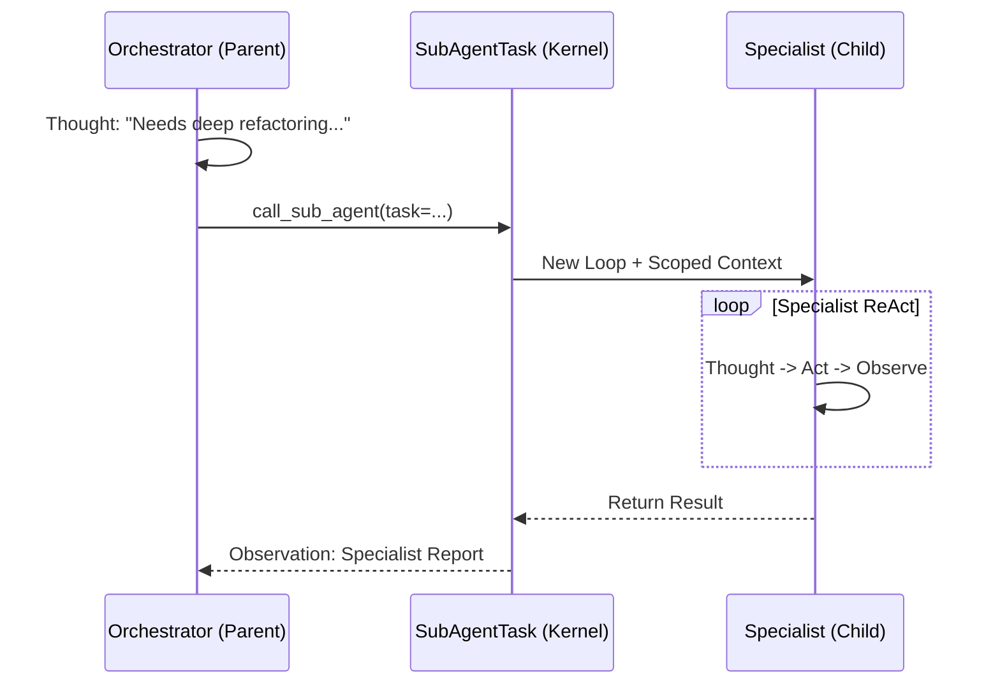

# Ganglia Sub-Agent Architecture

> **Status:** In Development
> **Version:** 0.1.7-SNAPSHOT
>
> **Module:** `ganglia-harness`
> **Package:** `work.ganglia.kernel.task` (SubAgentTask)
> **Related:** [Architecture](../ARCHITECTURE.md), [Core Kernel](CORE_KERNEL_DESIGN.md)

## 1. Objective

To enable complex task decomposition by allowing a primary Orchestrator Agent to delegate specialized sub-tasks to transient, focused "Sub-Agents" (Clones). This reduces primary context window pressure and enables expert-level execution.

## 2. Core Implementation Logic

Sub-Agents are implemented as a first-class `AgentTask` type (`SubAgentTask`), decoupling their execution from the parent loop.

### 2.1 Delegation Mechanism

- **Trigger**: The Orchestrator calls the `call_sub_agent` tool.
- **Scheduling**: `AgentTaskFactory` creates a `SubAgentTask`.
- **Execution**: The task instantiates a fresh `ReActAgentLoop` with a scoped context.

### 2.2 Context Scoping (Isolation)

To maintain focus, Sub-Agents use `ContextScoper` (in `work.ganglia.infrastructure.external.tool.subagent`):
- **Selective Injection**: Only mandatory mandates (from `GANGLIA.md`) and the specific sub-task are provided.
- **Clean Slate**: They do not inherit the full conversation history of the parent.

### 2.3 Result Consolidation

Once the Specialist finishes its loop, the final report is returned to the Orchestrator as a tool observation. Recursion is limited to one level by default.

## 3. Conceptual Sequence

## 4. Key Components

1. **`SubAgentTask`**: The `AgentTask` entry point in the Kernel.
2. **`DefaultGraphExecutor`**: Infrastructure used when multiple sub-agents are orchestrated in a DAG.

