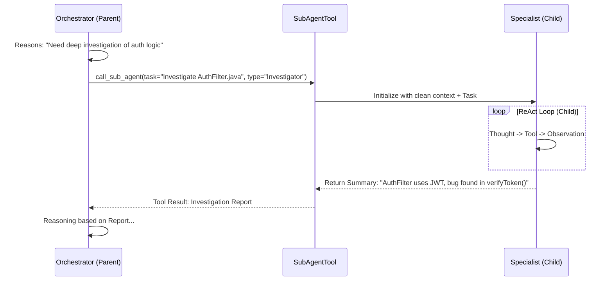

# Ganglia Sub-Agent Architecture Design

> **Status:** Initial Design
> **Module:** `ganglia-core`
> **Related:** [Architecture](ARCHITECTURE.md), [Core Kernel](CORE_KERNEL_DESIGN.md)

## 1. Objective
To enable complex task decomposition and efficient context management by allowing a primary Orchestrator Agent to delegate specialized sub-tasks to transient, focused "Sub-Agents" (Clones). This reduces the primary context window pressure and allows for expert-level execution in specific domains.

## 2. Core Implementation Logic

The Sub-Agent pattern in Ganglia follows a **Parent-Child** hierarchy invoked via a specialized tool.

### 2.1 Delegation Mechanism
Sub-Agents are triggered by the Orchestrator calling a specific tool, e.g., `call_sub_agent`.
- **Parameters**: `task_description`, `expert_persona` (optional), `required_files` (optional).
- **Execution**: The main loop suspends while the Sub-Agent runs its own independent ReAct loop.

### 2.2 Context Scoping (Isolation)
To prevent token explosion and maintain focus, Sub-Agents operate with a restricted context:
- **Clean Slate**: They start with a fresh message history.
- **Selective Injection**: Only the specific task and mandatory project context (from `GANGLIA.md`) are injected.
- **Reference Only**: They may receive snippets of relevant files but not the entire session history of the parent.

### 2.3 Specialized Personas
Sub-Agents can be initialized with custom system prompts to act as domain experts:
- **Code Investigator**: Focused on reading and understanding existing code without making changes.
- **Refactoring Expert**: Specialized in using `replace_in_file` for precise code modification.
- **Security Auditor**: Focused on identifying vulnerabilities or secret leaks.

### 2.4 Toolset Restriction (Sandboxing)
Sub-Agents do not necessarily have access to all tools available to the parent:
- **Investigator**: Only gets `ls`, `grep`, `read`.
- **Writer**: Gets `write_file` and `replace_in_file`.
- **Restricted Shell**: Access to `run_shell_command` might be disabled or limited for certain Sub-Agents.

### 2.5 Result Consolidation
Once a Sub-Agent finishes its loop (or reaches its iteration limit), it must return a structured summary:
- **Reporting**: The Child Agent summarizes its findings/actions into a concise report for the Parent.
- **State Feedback**: Any critical facts learned are returned to be merged into the Parent's `KnowledgeBase`.

### 2.6 Recursion & Termination Control
- **Maximum Depth**: Hard limit on nested Sub-Agent calls (default: 1) to prevent infinite loops.
- **Short-Lived Loops**: Sub-Agents have a lower `maxIterations` (e.g., 5-8) compared to the Orchestrator.

## 3. Conceptual Sequence

## 4. Key Components to Develop
1.  **`SubAgentTool`**: A standard `ToolSet` implementation that can instantiate a new `ReActAgentLoop`.
2.  **`ContextScoper`**: Logic to extract and prune the relevant context fragments for the child instance.
3.  **`ExpertManifest`**: A set of specialized system prompt templates for different sub-agent roles.
