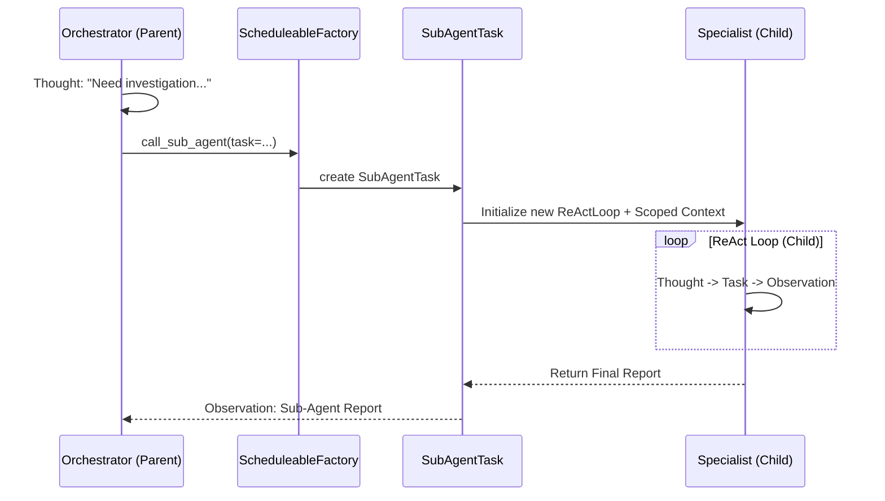

# Ganglia Sub-Agent Architecture (Implemented)

> **Status:** Implemented (v1.1.0)
> **Module:** `ganglia-core`
> **Related:** [Architecture](ARCHITECTURE.md), [Core Kernel](CORE_KERNEL_DESIGN.md)

## 1. Objective
To enable complex task decomposition and efficient context management by allowing a primary Orchestrator Agent to delegate specialized sub-tasks to transient, focused "Sub-Agents" (Clones). This reduces the primary context window pressure and allows for expert-level execution in specific domains.

## 2. Core Implementation Logic

Sub-Agents are implemented as a `Scheduleable` task type (`SubAgentTask`), decoupling their execution from the primary `ReActAgentLoop`.

### 2.1 Delegation Mechanism
Sub-Agents are triggered by the Orchestrator requesting the `call_sub_agent` tool.
- **Scheduling**: The `ScheduleableFactory` detects the intent and creates a `SubAgentTask`.
- **Execution**: The `SubAgentTask` instantiates a new `ReActAgentLoop` with a scoped context and runs it to completion.

### 2.2 Context Scoping (Isolation)
To prevent token explosion and maintain focus, Sub-Agents operate with a restricted context via `ContextScoper`:
- **Clean Slate**: They start with a fresh message history.
- **Selective Injection**: Only the specific task and mandatory project context (from `GANGLIA.md`) are injected.
- **Reference Only**: They may receive snippets of relevant files but not the entire session history of the parent.

### 2.3 Specialized Personas
Sub-Agents can be initialized with custom system prompts to act as domain experts:
- **Code Investigator**: Focused on reading and understanding existing code.
- **Refactoring Expert**: Specialized in using `replace_in_file` for precise code modification.
- **General**: A balanced assistant persona.

### 2.4 Toolset Restriction (Sandboxing)
Sub-Agents can have restricted tool access based on their persona. For example, an `INVESTIGATOR` may be denied access to destructive tools like `run_shell_command` or `write_file`.

### 2.5 Result Consolidation
Once a Sub-Agent finishes its loop, it returns a `ScheduleResult`:
- **Reporting**: The report content is appended to the parent's history as a tool observation.
- **Recursion Control**: A hard limit on nested Sub-Agent calls (default: 1) is enforced via metadata tracking.

## 3. Conceptual Sequence

## 4. Key Components
1.  **`SubAgentTask`**: The `Scheduleable` implementation that manages the child loop.
2.  **`ContextScoper`**: Logic to extract and prune the relevant context fragments for the child instance.
3.  **`ScheduleableFactory`**: Responsible for routing the delegation request to the task implementation.
