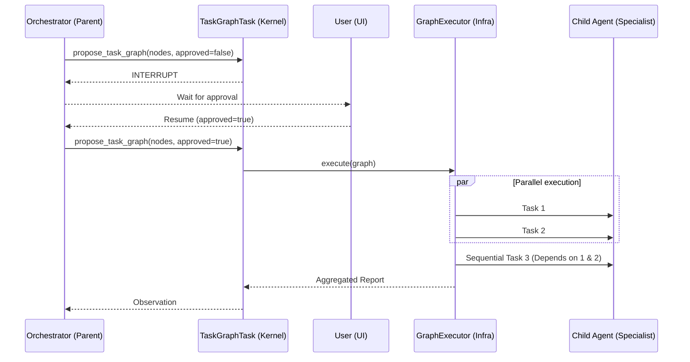

# Ganglia Sub-Agent Graph Orchestration

> **Status:** In Development
> **Version:** 0.1.7-SNAPSHOT
>
> **Module:** `ganglia-harness`
> **Package:** `work.ganglia.kernel.task` (TaskGraphTask)
> **Related:** [Sub-Agent Design](SUB_AGENT_DESIGN.md)

## 1. Objective

To enable complex task decomposition by allowing the primary Orchestrator to delegate tasks as a Directed Acyclic Graph (DAG). This enables parallel execution of specialized sub-agents.

## 2. Implementation Logic

### 2.1 `TaskGraphTask` (Kernel)

The Kernel handles the "Proposal" phase of a graph.
- **Argument**: `nodes` (List of task nodes), `approved` (boolean).
- **Interrupt**: If `approved=false`, the Kernel returns `AgentTaskResult.INTERRUPT`, allowing the user to review the plan in the UI.

### 2.2 `GraphExecutor` (Infrastructure Port)

Located in `work.ganglia.infrastructure.external.tool.subagent`.
- **Topological Sort**: Determines the execution order.
- **Concurrency**: Uses Vert.x `Future.all()` to run independent nodes simultaneously.
- **Reporting**: Collects outputs from all nodes into a final multi-stage report.

## 3. Data Flow



## 4. Enhanced TaskNode (Phase 1)

Starting from 0.1.7, `TaskNode` supports extended fields for mission-aware, isolation-capable graph execution:

```java
public record TaskNode(
    String id, String task, String persona, List<String> dependencies,
    Map<String, String> inputMapping,   // selective dependency output wiring
    String missionContext,              // global mission alignment (prepended to prompt)
    ExecutionMode mode,                 // SELF (single agent) | DELEGATE (sub-graph)
    IsolationLevel isolation            // NONE | SESSION | WORKTREE
)
```

- **Mission Context**: When set, the node prompt becomes `"MISSION: {m}\n\nTASK: {t}"` instead of just `"TASK: {t}"`. The mission is also propagated via `ContextScoper` metadata.
- **Input Mapping**: When provided, only mapped dependency outputs (keyed by alias) are injected, replacing the default behavior of including all dependency results.
- **Backward Compatibility**: A 5-arg constructor defaults `missionContext=null`, `mode=SELF`, `isolation=NONE`.

## 5. Blackboard: Cross-Cycle Fact Store

The `Blackboard` port interface (`work.ganglia.port.internal.state`) provides an append-only, event-sourced fact store for sharing state across execution cycles:

```java
public interface Blackboard {
    Future<Fact> publish(String managerId, String summary, String detailRef, int cycleNumber);
    Future<Void> supersede(String factId, String reason);
    Future<List<Fact>> getActiveFacts();
    Future<String> getFactDetail(String factId);
    Future<Integer> getSupersededCount();
    Future<Integer> getNewFactCount(int lastNCycles);
}
```

- **Fact Record**: Immutable with `id`, `version` (optimistic concurrency), `summary` (L1 context), `detailRef` (L2 cold storage), `status` (ACTIVE/SUPERSEDED/ARCHIVED), `cycleNumber`.
- **InMemoryBlackboard**: ConcurrentHashMap-based adapter with AtomicInteger ID generation and optimistic versioning via `ConcurrentHashMap.replace(key, expected, new)`.
- **Observations**: `FACT_PUBLISHED`, `FACT_SUPERSEDED`, `FACT_ARCHIVED` added to `ObservationType`.

## 6. Safety & Efficiency

- **Parallelism**: Limited by the Vert.x worker pool.
- **Context Management**: Each node receives the output of its parent dependencies as context, but remains isolated from the Orchestrator's main history.
- **Abort Granularity**: `AgentSignal` now supports `AbortReason` (USER_CANCELLED, MISSION_SUPERSEDED, BUDGET_EXCEEDED, STALL_DETECTED) for distinguishing abort scenarios.

