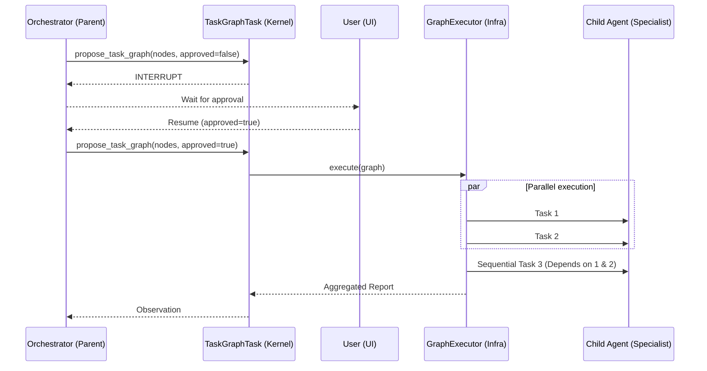

# Ganglia Sub-Agent Graph Orchestration (Implemented)

> **Status:** Implemented (v1.2.0)
> **Module:** `ganglia-core`
> **Package:** `work.ganglia.kernel.task` (TaskGraphTask)
> **Related:** [Sub-Agent Design](SUB_AGENT_DESIGN.md)

## 1. Objective
To enable complex task decomposition by allowing the primary Orchestrator to delegate tasks as a Directed Acyclic Graph (DAG). This enables parallel execution of specialized sub-agents.

## 2. Implementation Logic

### 2.1 `TaskGraphTask` (Kernel)
The Kernel handles the "Proposal" phase of a graph.
- **Argument**: `nodes` (List of task nodes), `approved` (boolean).
- **Interrupt**: If `approved=false`, the Kernel returns `SchedulableResult.INTERRUPT`, allowing the user to review the plan in the UI.

### 2.2 `GraphExecutor` (Infrastructure Port)
Located in `work.ganglia.infrastructure.external.tool.subagent`.
- **Topological Sort**: Determines the execution order.
- **Concurrency**: Uses Vert.x `Future.all()` to run independent nodes simultaneously.
- **Reporting**: Collects outputs from all nodes into a final multi-stage report.

## 3. Data Flow

## 4. Safety & Efficiency
- **Parallelism**: Limited by the Vert.x worker pool.
- **Context Management**: Each node receives the output of its parent dependencies as context, but remains isolated from the Orchestrator's main history.
