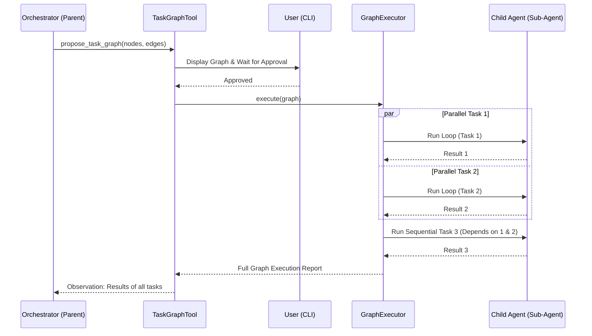

# Ganglia Sub-Agent Graph Orchestration (Implemented)

> **Status:** Implemented (v1.0.0)
> **Module:** `ganglia-core`
> **Related:** [Architecture](ARCHITECTURE.md), [Sub-Agent Design](SUB_AGENT_DESIGN.md)

## 1. Objective
To enable complex task decomposition and efficient execution by allowing the primary Orchestrator to delegate tasks as a Directed Acyclic Graph (DAG). This allows for both parallel and sequential execution of specialized sub-agents with human-in-the-loop validation.

## 2. Core Concepts

### 2.1 Task Graph (DAG)
A set of tasks where some tasks depend on the completion of others. 
- **Parallel Execution**: Tasks with no dependencies or whose dependencies are met can run simultaneously.
- **Sequential Execution**: Tasks that wait for previous tasks to finish.

### 2.2 Human-in-the-Loop (Approval)
The Orchestrator proposes a task graph. The user must review and approve the graph before execution starts.

## 3. Implementation Logic

### 3.1 `propose_task_graph` Tool
A tool used by the Orchestrator to define the plan.
- **Arguments**: 
    - `nodes`: List of task nodes.
    - `edges`: List of dependencies between nodes.
- **Behavior**: This tool triggers an **Interrupt**. The CLI displays the graph (e.g., as a Mermaid diagram or list) and waits for user confirmation.

### 3.2 `GraphExecutor`
A component responsible for executing the approved DAG.
- **Topological Sort**: Determines the execution order.
- **Concurrent Execution**: Uses Vert.x `Future.all()` or manual tracking to run independent nodes in parallel.
- **Context Management**: Each node runs in a fresh `ReActAgentLoop` with scoped context.

### 3.3 Data Flow
- **Input Sharing**: Nodes can specify that they need the output of a dependency as part of their task description.
- **Aggregation**: Once the graph completes, a "Reducer" step (or the Parent agent) synthesizes the results.

## 4. Node Definition
```json
{
  "id": "task-1",
  "task": "Investigate file A",
  "persona": "INVESTIGATOR",
  "dependencies": []
}
```

## 5. Sequence Diagram



## 6. Constraints & Safety
- **Max Parallelism**: Hard limit on concurrent sub-agents (e.g., 5).
- **Depth Limit**: No nested graph calls beyond level 1.
- **Timeout**: Global timeout for graph execution.
