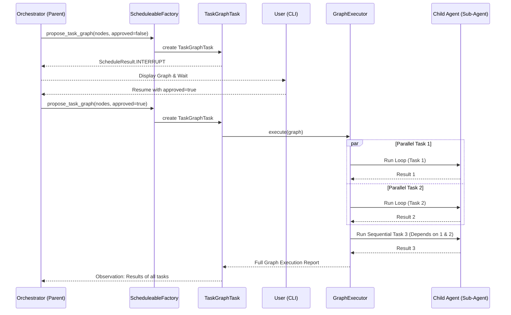

# Ganglia Sub-Agent Graph Orchestration (Implemented)

> **Status:** Implemented (v1.1.0)
> **Module:** `ganglia-core`
> **Related:** [Architecture](ARCHITECTURE.md), [Sub-Agent Design](SUB_AGENT_DESIGN.md)

## 1. Objective
To enable complex task decomposition and efficient execution by allowing the primary Orchestrator to delegate tasks as a Directed Acyclic Graph (DAG). This allows for both parallel and sequential execution of specialized sub-agents with human-in-the-loop validation.

## 2. Core Concepts

### 2.1 Task Graph (DAG)
A set of tasks where some tasks depend on the completion of others. 
- **Parallel Execution**: Tasks with no dependencies or whose dependencies are met can run simultaneously.
- **Sequential Execution**: Tasks that wait for previous tasks to finish.

### 2.2 Human-in-the-Loop (Approval)
The Orchestrator proposes a task graph. The user must review and approve the graph before execution starts.

## 3. Implementation Logic

### 3.1 `propose_task_graph` Task
Handled by `TaskGraphTask` (a `Scheduleable` type).
- **Arguments**: 
    - `nodes`: List of task nodes.
    - `approved`: Boolean flag indicating user consent.
- **Behavior**: 
    - If `approved=false`, the task returns a `ScheduleResult.INTERRUPT`, prompting the user for confirmation.
    - If `approved=true`, it delegates execution to the `GraphExecutor`.

### 3.2 `GraphExecutor`
A component responsible for executing the approved DAG.
- **Topological Sort**: Determines the execution order.
- **Concurrent Execution**: Uses Vert.x `Future.all()` to run independent nodes in parallel.
- **Context Management**: Each node runs in a fresh `ReActAgentLoop` with scoped context.
- **Integration**: Depends on `ScheduleableFactory` to create the child loops.

### 3.3 Data Flow
- **Input Sharing**: Nodes receive the output of their dependencies as part of their initial prompt.
- **Aggregation**: Once the graph completes, `GraphExecutor` synthesizes a full report.

## 4. Sequence Diagram

## 5. Constraints & Safety
- **Max Parallelism**: Managed by Vert.x worker pool limits.
- **Recursion**: No nested graph calls beyond level 1.
- **Persistence**: Graph state is summarized into the session context for resumption.
