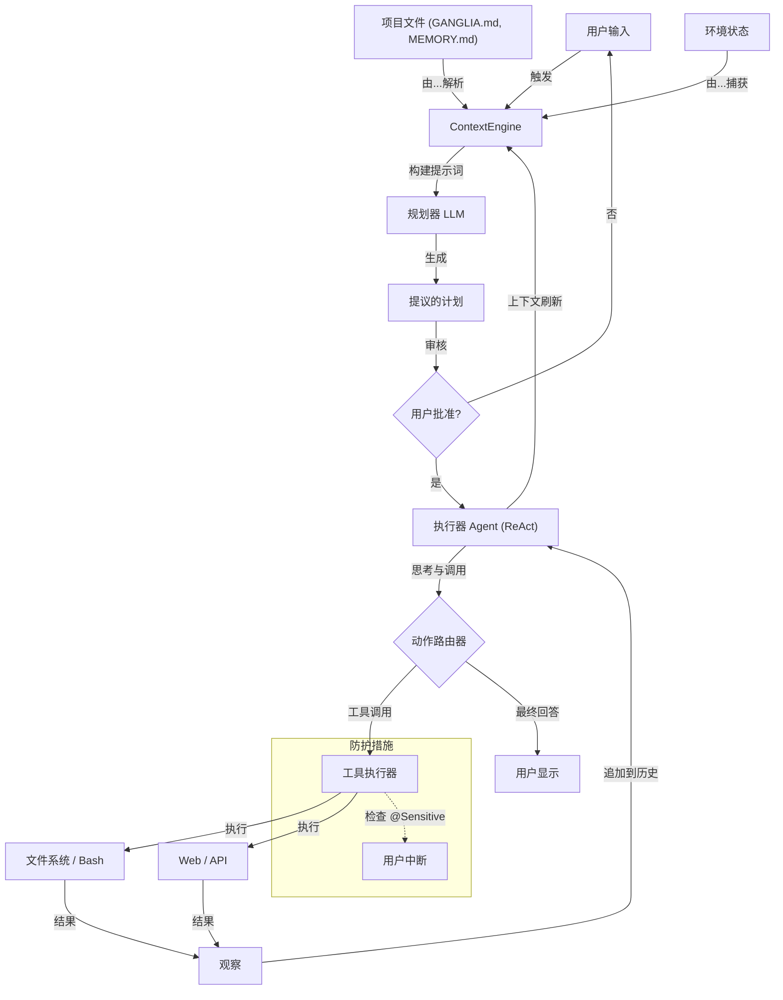

# Ganglia 架构文档

> **状态**：草案 / 初始设计
> **版本**：0.1.0

## 1. 系统概述

**Ganglia** 是一个专为集成到第三方应用程序而设计的 Java Agent 框架。它优先考虑**简单性、鲁棒性和透明度**，而非复杂、不透明的多 Agent 图结构。

核心设计理念灵感源自 **Claude Code**：一个强大的单一控制循环，利用混合工具集和透明的、基于文件的记忆系统。

## 2. 核心设计原则

1.  **单一控制循环（ReAct 循环）**：
    - 避免复杂的图结构或状态机。
    - 使用由单一主线程处理的扁平消息历史。
    - 流程：`输入 -> [思考 -> 工具 -> 观察] * N -> 回答`。

2.  **工具优先导航**：
    - Agent 使用工具（`grep`, `glob`, `read`）探索代码库，而非依赖预计算的、不透明的向量嵌入（RAG）。
    - “Agent 搜索”允许模型自主构建查询并根据反馈进行优化。

3.  **记忆即代码**：
    - 记忆存储在用户项目中的 **Markdown 文件**（`MEMORY.md`，会话日志）中。
    - 透明、可编辑且受 Git 版本控制。

4.  **通过提示词的可控性**：
    - 行为由广泛、结构化的提示词（XML, 示例）控制，而非硬编码逻辑。
    - 遵循“系统提醒”和“语气”指南。
    - 核心指令通过 [核心指南](CORE_GUIDELINES_DESIGN.md) (`GANGLIA.md`) 管理。

## 3. 逻辑架构

### 3.1 模型层（“大脑”）

- **统一接口**：抽象层（`ModelGateway`）隐藏了 LLM 提供商（OpenAI, Anthropic 等）的具体细节。
- **低延迟流式处理**：
  - 使用 `chatStream` 通过 Vert.x EventBus 向用户提供实时反馈。
  - 推理过程（“思考”）在生成时流式传输到 UI，而完整响应在内部累足以执行工具。
- **智能路由**：
  - **快速模型（如 Haiku）**：处理常规任务，如文件摘要、读取 git 历史和 Token 计数。
  - **智能模型（如 GPT-4o, Sonnet）**：处理主 ReAct 循环、推理和规划。

### 3.2 工具与执行（“双手”）
- **定义**：工具通过实现 `ToolSet` 的 Java 类定义。
- **混合工具集**：
  - **低级**：`Bash` 执行（通过 `BashTools`），`write_file`（原子写）。
  - **高级**：`grep_search`, `glob`, `Edit`（智能代码替换），`web_fetch`（通过 Vert.x WebClient）。
- **结构化错误处理**：工具返回 `ToolInvokeResult`。
- **安全**：
  - **沙箱**：在隔离环境中执行不可信代码。
  - **内存保护**：内置防护措施，防止大型工具输出导致内存耗尽（例如，每轮调用限制为 8KB）。
  - **早期验证**：在读取文件前验证大小（最大 8KB）以保护上下文窗口。
  - **人机交互**：标记为“敏感”的工具（或显式的 `ask_selection` 调用）需要用户交互。

### 3.3 记忆系统

详情请参阅 [记忆架构](MEMORY_ARCHITECTURE.md)。

- **三层架构**：
    - **短期（轮次）**：高保真执行细节。
    - **中期（会话）**：通过滑动窗口或摘要管理的压缩上下文。
    - **长期（项目）**：精选的 `MEMORY.md` 和存档日志。
- **检索**：对长期记忆进行 Agent 搜索（`grep`, `read`）。
- **注入**：相关的记忆片段由 **ContextEngine** 注入到当前提示词中（优先级 10）。

### 3.4 工作流管理

- **待办事项列表**：Agent 维护一个自管理的任务列表，防止在长会话中迷失方向。
- **克隆（临时委托）**：
  - 对于复杂的子任务，Agent 可以生成一个“克隆”（具有特定上下文的新实例）。
  - 克隆执行任务并将结果作为工具输出返回。
  - 这保持了主上下文窗口的整洁。

### 3.5 技能系统（“专业知识”）

- **模块化**：行业或领域特定的知识和工具被封装为“技能”。
- **动态激活**：可以按会话激活/停用技能，保持基础系统提示词的聚焦。
- **上下文注入**：活跃技能将专业指南注入并向循环注册领域特定工具。

### 3.6 上下文管理引擎 (ContextEngine)

**ContextEngine** 负责系统地构建 LLM 系统提示词。它确保 Agent 始终拥有最相关的信息，同时保持在 Token 限制内。

- **分层构建**：根据严格的优先级层次（1-10）叠加上下文片段（人设、指令、环境、技能、计划、记忆）。
- **解耦解析**：使用 `ContextResolver` 从静态文件（`GANGLIA.md`）、动态状态（ToDo 列表）和语义记忆中获取数据。
- **智能修剪**：当接近 Token 限制时，`ContextComposer` 修剪较低优先级的片段（如历史记忆），同时保留“核心指令”（人设和指令）。

## 4. 人机交互

Ganglia 采用**“计划优先，随后执行”**的理念，以确保用户对复杂任务的控制以及运行时防护。

### 4.1 “计划优先”模式（架构级）

在执行复杂请求之前，系统进入**规划阶段**：

1.  **分解**：专门的“规划器”LLM 实例分析请求并生成结构化的 JSON 计划（`List<Step>`）。
2.  **审核**：计划提交给用户审批或修改。
3.  **执行**：只有经批准的步骤才会进入 ReAct 执行器的待办事项列表。

### 4.2 运行时中断（基于工具）

- **敏感工具**：标记为 `@Sensitive` 的工具（如 `delete_file`, `deploy`）会自动触发**用户确认**中断。
- **`ask_selection` 工具**：Agent 可以显式调用此工具来解决歧义或请求输入（支持文本和选择模式）。
- **执行暂停**：ReAct 循环挂起状态并等待用户输入，然后再恢复。

## 5. 数据流（ReAct 循环）

## 6. 技术栈

- **语言**：Java 17+
- **核心框架**：Vert.x (响应式, 非阻塞 I/O)
- **LLM 客户端**：OpenAI-Java (官方)
- **可观测性**：OpenTelemetry
- **测试**：JUnit 5
