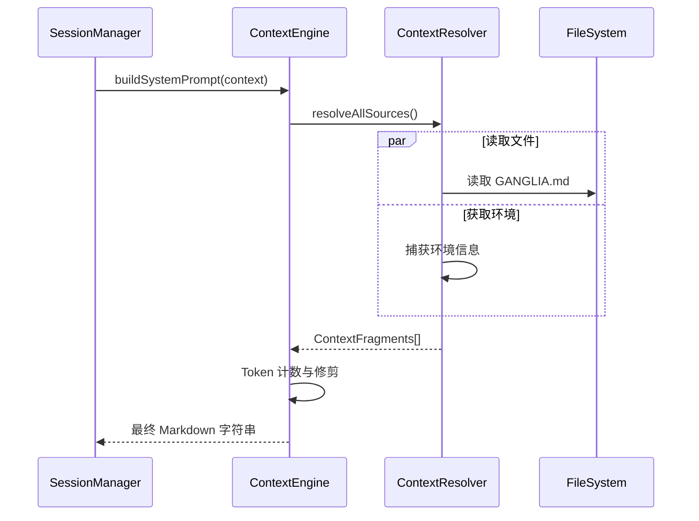

# Ganglia 上下文管理架构设计 (ContextEngine)

> **状态**：初始设计
> **模块**：`ganglia-core` (提示词增强)
> **相关**：[架构](ARCHITECTURE.md), [核心指南](CORE_GUIDELINES_DESIGN.md)

## 1. 目标
受 `GEMINI.md` 机制启发，提供一个透明、可编辑且分层的上下文构建系统。通过解耦项目规范、操作规则、实时状态和领域知识，系统地构建提示词。

## 2. 核心组件

### 2.1 `ContextSource`
定义上下文来源的接口。
- **StaticSource**：项目根目录中的 Markdown 文件（如 `GANGLIA.md`, `ARCHITECTURE.md`）。
- **DynamicSource**：运行时状态，如 `ToDoList` 和 `SessionHistory`。
- **SemanticSource**：从 `MEMORY.md` 检索到的语义片段。
- **EnvironmentSource**：系统信息（操作系统、Java 版本、目录结构快照）。

### 2.2 `ContextResolver`
负责将 `ContextSource` 转换为标准化的 `ContextFragments`。
- **标题解析**：支持根据 Markdown 二级标题 (`##`) 拆分文件片段。
- **变量替换**：支持变量注入，如 `${project.name}`。

### 2.3 `ContextComposer`
负责根据优先级和模板组合片段的核心引擎。
- **优先级管理**：为每个片段分配一个优先级 (1-10)。
- **Token 修剪**：当总 Token 超过模型的窗口（系统提示词目标为 2000 tokens）时，非强制性片段按从低到高的优先级进行修剪。
- **安全截断**：最终的硬截断检查，确保生成的提示词永远不会超过模型的预算。

## 3. 上下文层级

系统提示词通过根据优先级叠加载片段来构建。较低的优先级数字表示对 Agent 的身份和安全至关重要的“核心”指令。

| 优先级 | 模块名称 | 作用 | 来源 |
| :--- | :--- | :--- | :--- |
| 1 | **人设 (Persona)** | **我是谁？** (Agent 身份和语气) | 核心配置 |
| 2 | **强制指令 (Mandates)** | **我的硬性规则是什么？** (操作和安全禁止事项) | `GANGLIA.md` [指令] |
| 3 | **项目上下文** | **我在使用什么技术？** (编码标准和项目特定知识) | `GANGLIA.md` [上下文] |
| 4 | **环境** | **我在哪里？** (操作系统、工作目录和目录树快照) | 系统调用 |
| 5 | **活跃技能** | **我的特长是什么？** (特定领域的启发式方法) | `SkillRegistry` |
| 6 | **当前计划** | **目标是什么？** (任务分解和当前进展) | 衍生自用户任务 |
| 10 | **记忆** | **我学到了什么？** (来自语义搜索的历史片段) | `MEMORY.md` |

### 3.1 用户任务的角色
**用户任务**（初始输入）是整个层级的催化剂。
1. **输入**：用户提交原始请求（如“修复 Main 中的错误”）。
2. **分解**：Agent（或规划器）将此请求转换为结构化的 **ToDo 列表**。
3. **注入**：该计划以**优先级 6** 注入，确保即使对话历史变得非常长，Agent 也能保持“目标意识”。

### 3.2 Token 修剪逻辑
当组合后的上下文超过模型的 Token 限制时，`ContextComposer` 应用**自底向上修剪**策略：
- **易失性上下文**：记忆（优先级 10）最先被移除。
- **操作性上下文**：4-6 级（环境、技能、计划）如果必要，会被修减或总结。
- **“核心指令”**：人设和强制指令（优先级 1-2）**绝不**会被修剪，确保 Agent 保持安全并留在其定义的运行边界内。

## 4. 交互序列



## 5. 配置示例 (`GANGLIA.md`)

```markdown
# Ganglia 项目上下文

## [操作强制指令]
- 始终优先使用非阻塞 Vert.x API。
- 绝不修改 `.git` 目录。

## [项目规范]
- 使用 Java 17 Records 作为 DTO。
- 所有异步操作必须返回 `io.vertx.core.Future`。
```
