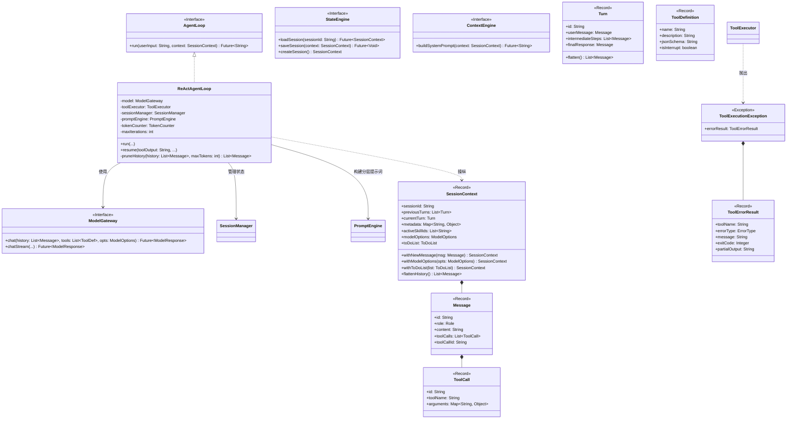
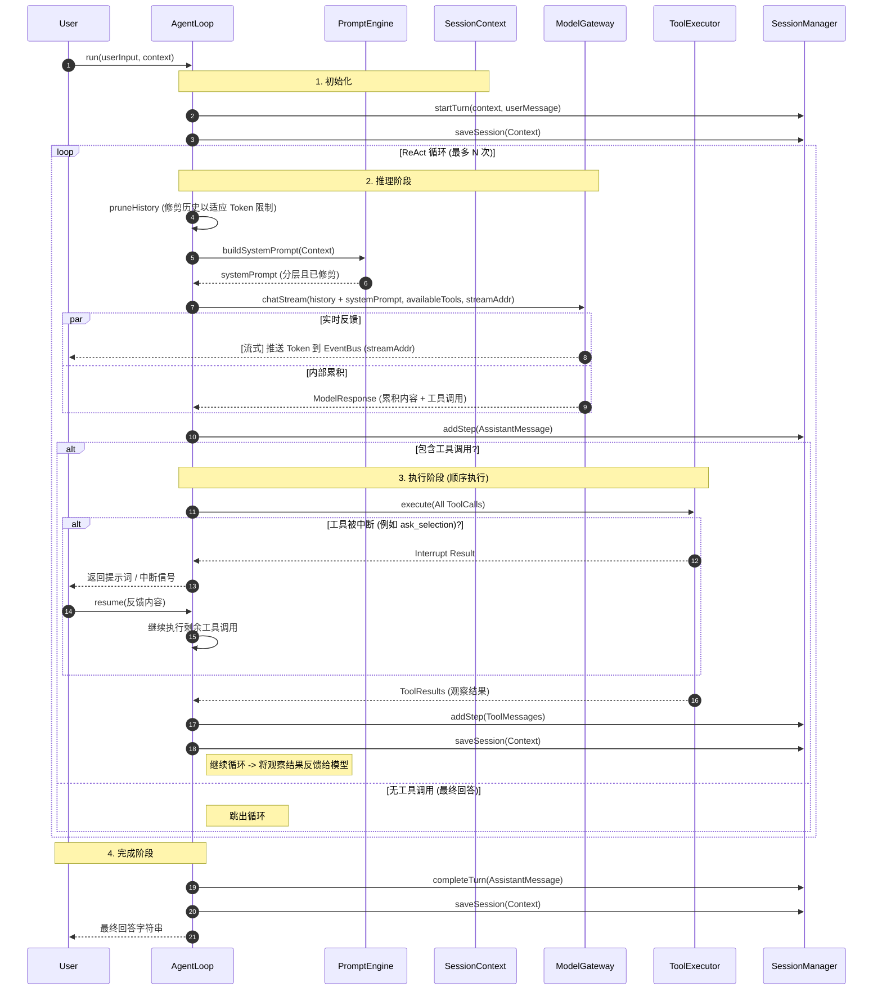
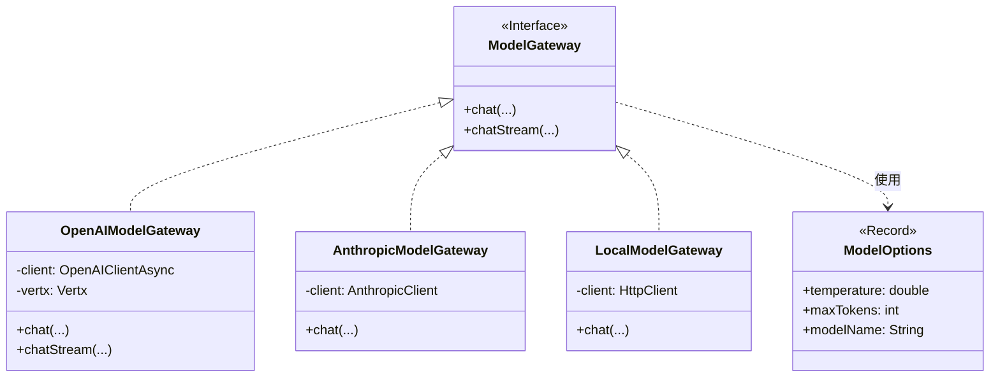

# Ganglia 核心内核设计 (Core Kernel)

> **模块**：`ganglia-core`
> **状态**：详细设计（UML 与时序图）
> **包名**：`me.stream.ganglia.core`

本文档使用 UML 和时序图概述了核心内核模块的详细设计。

## 1. 类图：核心组件

此图展示了主要实体之间的关系：`AgentLoop`、`ModelGateway`、`SessionManager` 和领域模型。

## 2. 时序图：ReAct 循环

此图详细说明了 `AgentLoop.run()` 方法的流程，展示了“思考 -> 工具 -> 观察”的循环。

## 3. 类图：模型抽象

详细说明支持多个 LLM 提供商的层级结构。

