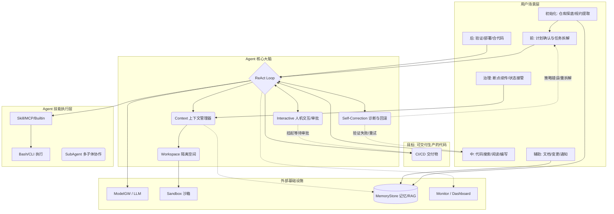

# Agentic 软件工程模型架构图与场景补充

## 1. 补充完整的 Mermaid 图

基于我们之前讨论的**“状态演进（自我纠错/回滚）”**、**“人机协作（审批锚点）”**以及**“记忆沉淀”**，我对原有的 Mermaid 架构图进行了完善和连线补充：

---

## 2. 确认用户场景是否还有缺失？

根据标准的 SDLC（软件开发生命周期）以及一线研发人员的痛点，目前的 `Pre` -> `Mid` -> `Post` -> `Aux` 已经非常完备了。

但是，如果从 **“非快乐路径 (Unhappy Path)”** 和 **“Day 2 运维 (长期演进)”** 的角度来看，还有 **2 个关键场景**在当前的分类中没有被显式强调：

### 缺失场景 A：Onboarding 与环境摸底 (Zero-to-One Context Gathering)
*   **痛点：** 用户把你拉进一个几百万行的屎山代码库，没有任何文档。
*   **场景描述：** Agent 刚接手一个项目时，需要自主进行**依赖分析、脚手架探测、运行架构反推**（就像我们刚才讨论的 `gemini init` 生成 `GEMINI.md` 的过程）。
*   **归属建议：** 应该在 `Pre` 前面加一个 **`Init: 探底与知识库初始化`**。这决定了后续所有任务的准确率。

### 缺失场景 B：中断与状态接管 (Interruption & Handover)
*   **痛点：** Agent 改几十个文件，改到一半发现网络断了，或者用户突然下班了说“明天再搞”。
*   **场景描述：** 系统能够随时冻结当前的上下文（包括内存状态和沙箱里的文件快照），并在未来某一天甚至由**另一个人类开发者**接管这个残局。
*   **归属建议：** 这个属于跨越生命周期的 **`Ops: 会话与工作区治理`**。

### 总结：终极版场景层 (Scenes) 划分

如果你想把 Ganglia 的商业故事讲得无懈可击，场景层可以扩充为：

1.  **Init (初始化):** 仓库探底、规约提取、生成 `GEMINI.md`。
2.  **Pre (前置):** 计划确认、架构设计、任务拆解。
3.  **Mid (执行):** 语义导航、代码编写、重构。
4.  **Post (验证):** 闭环排错、测试运行、代码合并。
5.  **Aux (辅助):** 文档更新、长时记忆沉淀。
6.  **Ops (治理):** 状态挂起、断点续传、沙箱清理。

这样，Agent 就不再只是个“帮你写代码的工具”，而是一个**全生命周期管理的数字员工**。