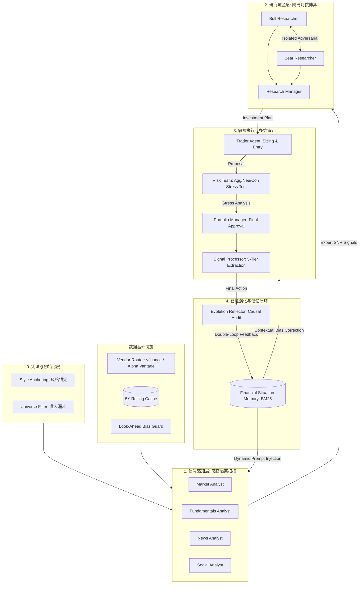

# TradingAgents: 多智能体自进化资管系统架构设计说明书 (V1.0 Implementation)

本架构旨在构建一个具备"逻辑冗余"与"自适应韧性"的闭环资管机构，严格对齐 Python 源码实现。

> **知识导航 (Knowledge Hub)**
>
> - [📖 业务白皮书: 投资哲学与演化逻辑](trading_agents_domain_knowledge_whitepaper.md)

---

## I. 系统架构全景图 (System Topology)

---

## II. 核心层级职能与"白皮书"逻辑映射

### 0. 数据基础设施层 (Data Infrastructure)

- **职能**：为全部分析 Agent 提供可靠、无偏的数据供给。
- **双引擎路由 (Vendor Router)**：内置 `yfinance` 与 `Alpha Vantage` 双引擎。支持分类级别 (`data_vendors`) 和工具级别 (`tool_vendors`) 两级配置覆盖，工具级别优先级更高。
- **自动回退 (Vendor Fallback)**：当主数据源触发 `AlphaVantageRateLimitError` 时，`route_to_vendor()` 自动尝试备用数据源，保证分析流程不中断。
- **前视偏差防护 (Look-Ahead Bias Guard)**：所有历史数据在数据层按 `curr_date` 参数自动过滤——`load_ohlcv()` 过滤行情数据，`filter_financials_by_date()` 过滤财务报告期——确保回测场景下不泄漏未来信息。
- **5年滚动缓存**：行情数据按 `{symbol}-YFin-data-{start}-{end}.csv` 格式本地缓存，5年滚动窗口，避免重复拉取。
- **指数退避重试 (Exponential Backoff)**：yfinance 数据拉取遇到 Rate Limit 时执行3次指数退避重试（2s/4s/8s），保障数据获取稳定性。
- **技术细节**：详见 [外部数据源文档](external_data_sources.md)。

### 1. 宪法与初始化层 (Constitution)

- **职能**：设定"我们要赚什么样的钱"。通过 PM 节点预设风格权重（Style Weights）和标的黑白名单（Universe Filter）。
- **配置项**：`max_debate_rounds`, `max_risk_discuss_rounds`, `output_language` (支持多语言输出)。
- **标的上下文 (Instrument Context)**：通过 `instrument_context` 为每个 Agent 注入标的类型信息（股票/加密货币等），确保分析逻辑与标的特性匹配。
- **相关内容**：参见 [白皮书第一章](trading_agents_domain_knowledge_whitepaper.md#第一章确定航向建立数字化投资宪法)。

### 2. 信号感知层 (The Perception Layer)

- **职能**：实现**"感官隔离 (Sensory Deprivation)"**。
- **Agent 定义**：
  - **Market Analyst**: 从 13 种技术指标中选择最多 8 个互补指标（SMA/EMA/MACD/RSI/Bollinger/ATR/VWMA/MFI），每个指标附带用途说明和使用技巧。工具调用顺序：先 `get_stock_data` 获取 CSV，再 `get_indicators` 计算指标。
  - **Fundamentals Analyst**: 穿透式财务报表审计，可用工具：`get_fundamentals`（综合指标）、`get_balance_sheet`、`get_cashflow`、`get_income_statement`（财务三表，支持 annual/quarterly 频率）。
  - **News Analyst**: 捕捉全球宏观（`get_global_news`，默认7天回溯）和公司新闻（`get_news`）。
  - **Social Analyst**: 通过 `get_news` 工具搜索特定公司的社交媒体提及和情绪数据。
- **技术细节**：详细 Prompt 见 [Prompt 库第 1 节](all_agents_prompts.md#1-analyst-team-分析师团队)，可用工具见 [技能工具汇总第 2 节](agents_tools_and_skills.md#2-代理工具映射-agent-tool-mapping)。

### 3. 研究炼金层 (Research Crucible)

- **职能**：执行**"对抗性辩论 (Isolated Adversarial Debate)"**。
- **记忆增强**：Bull 和 Bear 研究员分别拥有独立的 `Financial Situation Memory` (BM25)。
- **信息注入**：双方均接收全部四份分析报告（Market/Sentiment/News/Fundamentals）、对话历史、对方上轮论点及历史记忆反思。
- **逻辑机制**：
  - **隔离生成**：Bull/Bear 在完全屏蔽对手方的前提下挖掘论据。详见 [Prompt 库第 2 节](all_agents_prompts.md#2-research-team-研究团队)。
  - **交叉质证**：Research Manager (Invest Judge) 负责提炼原始分歧，并拥有独立的 `Invest Judge Memory` 进行决策校准。

### 4. 敏捷执行与风险审计 (Execution & Risk)

- **职能**：将"感性逻辑"转化为"操作理性"。
- **组件**：
  - **Trader**: 负责头寸建议，拥有专属 `Trader Memory`。接收 Research Manager 产出的投资计划及标的上下文。见 [Prompt 库第 4 节](all_agents_prompts.md#4-trader-交易员)。
  - **Risk Team**: 三位审计员（Aggressive/Conservative/Neutral）执行循环辩论，各自接收全部四份分析报告及交易员决策。见 [Prompt 库第 5 节](all_agents_prompts.md#5-risk-management-team-风控团队)。
  - **Portfolio Manager**: 终审决策，拥有 `Portfolio Manager Memory`，输出五级评分（Buy/Overweight/Hold/Underweight/Sell）。
  - **Signal Processor**: 利用专用 LLM (`quick_think_llm`) 从 Portfolio Manager 的非结构化输出中提取标准化的五级信号。

### 5. 智慧演化与记忆闭环 (Evolution & Memory)

- **职能**：**"剥离运气，沉淀智慧"**。
- **核心组件**：
  - **Reflector**: 对每个角色（Bull/Bear/Trader/Judge/PM）独立执行反思，按"推理 (Reasoning) → 改进 (Improvement) → 总结 (Summary) → 查询 (Query)"四步法生成结构化经验教训，存入对应角色的隔离记忆库。
  - **BM25 Memory**: 存储"情境 (Situation) - 建议 (Advice)"对。使用 Okapi BM25 纯词汇匹配，原始分数归一化到 [0, 1] 区间。无需 embedding API，纯本地计算，跨 LLM 提供商可用。
- **设计哲学**：参见 [业务逻辑蒸馏第 5 节](business_domain_knowledge_distillation.md#5-总结复刻者的核心原则)。

## III. 技术实现的硬性约束 (Implementation Guardrails)

1.  **物理隔离协议**：LangGraph 中的节点状态流转必须确保 Adversarial 角色在同一 turn 内不共享上下文。
2.  **前视偏差零容忍 (Look-Ahead Bias Zero Tolerance)**：所有历史数据必须经过 `curr_date` 过滤。`load_ohlcv()` 过滤行情数据行，`filter_financials_by_date()` 过滤超出当前日期的财务报告期。任何绕过此机制的数据路径均视为系统缺陷。
3.  **数据供给连续性 (Data Supply Continuity)**：分析流程不得因单一数据源故障而中断。`route_to_vendor()` 在主数据源 Rate Limit 时自动回退到备用数据源；yfinance 层面执行指数退避重试（3次，2s/4s/8s）。
4.  **对称演化约束**：人类 PM 的决策必须接受 Reflector 的"一致性审计"，防止主观偏见污染记忆库。
5.  **贝叶斯概率流**：所有 Agent 的输出必须包含 `confidence` 字段。事后审计需将 `confidence` 与历史 `Regime Hit Rate` 进行对齐，防止"主观盲目自信"。
6.  **去人格化复盘**：归因分析仅针对"逻辑节点"而非"Agent 名称"，防止产生角色歧视。
7.  **失败逻辑优先原则 (Failure-Logic Priority)**：Reflector 必须强制记录并归因"负向收益案例"。禁止"只报喜不报忧"。
8.  **记忆注入权重的非对称性 (Memory Injection Asymmetry)**：在进行 Prompt 记忆注入时，**历史警示 (Warning Logic)** 的 Token 权重必须显著高于 **历史经验 (Success Logic)**。这是一种"防御性架构"，旨在通过记住深坑来保持系统在市场不确定性下的韧性。
9.  **受控的上下文交叉 (Controlled Context Sharing)**：在维持分析师"感官剥夺"的前提下，允许在第二轮摘要生成时共享关键 `Regime Tags`，以消除逻辑孤岛效应。
10. **记忆的时间有效性约束 (Temporal Validity Guardrail)**：系统在检索记忆时必须应用 **时间衰减因子 (TWR)**。任何超过 12 个月的逻辑在未经过 **宏观代际校验 (Macro Epoch Validation)** 前，不得作为主导决策。
11. **逻辑漂移监测 (Logic Drift Monitoring)**：审计节点需监控 `Confidence` 与实际盈亏的偏差走势。若偏差持续扩大，应触发"全局记忆清洗 (Memory Pruning)"，清除陈旧且无效的逻辑锚点。
12. **记忆角色隔离 (Memory Role Isolation)**：Bull/Bear/Trader/Judge/PM 五个角色的 `FinancialSituationMemory` 必须相互隔离。Reflector 对每个角色独立执行反思并写入对应记忆库，防止跨角色的逻辑污染。
13. **信号归一化 (Signal Normalization)**：Portfolio Manager 的非结构化输出必须经过 Signal Processor 提取为标准五级评分（BUY/OVERWEIGHT/HOLD/UNDERWEIGHT/SELL），确保下游消费的确定性。
